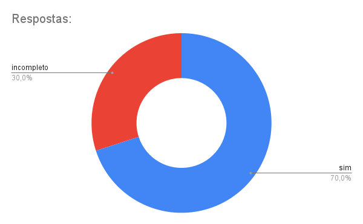

# Apresentações

## Introdução

Este documento contem as gravações das entregas do projeto da disciplina Interação Humano , bem como os principais aspectos avaliados na etapa do desenvolvimento.

## Entrega 01

Nesta primeira entrega do projeto estão contidos os seguintes pontos:

- Planejamento do Projeto;
- Equipe;
- Lista de sites avaliados;
- Site selecionado para o projeto da disciplina;
- Ferramentas do projeto;
- Processo de Design;
- cronograma das atividades;
- Atas das reuniões;
- Gravação da apresentação.

### Aspectos avaliados

**Tabela 1** - Aspectos avaliados na entrega 1.

|                                         | O github pages possui:                                                                                                                                                                             | Resposta | Versão, data e horário da avaliação |
| --------------------------------------- | -------------------------------------------------------------------------------------------------------------------------------------------------------------------------------------------------- | -------- | ----------------------------------- |
| Itens do Planejamento Geral do projeto. | 1 – Uma página apresentando os integrantes da equipe (com foto) com nome e sem matrícula?                                                                                                          | Sim      | 1.1, 12/11/2024, 21:45              |
|                                         | 2 - o cronograma do planejamento apresenta todas as atividades de todas as etapas para cada integrante com as datas de início e fim das entrega dos artefatos e com o período da revisão deles?    | Sim      | 1.2, 12/11/2024, 21:46              |
|                                         | 3 - o cronograma do planejamento apresenta um período de gravação da apresentação de cada etapa.                                                                                                   | Sim      | 1.2, 12/11/2024, 21:47              |
|                                         | 4 - O cronograma prever um período de revisão/ajustes nos artefatos devidos as considerações dos monitores/professor?                                                                              | Sim      | 1.2, 12/11/2024, 21:56              |
|                                         | 5 - A motivação e os critérios para a escolha do site?                                                                                                                                             | Sim      | 1.0, 12/11/2024, 21:52              |
|                                         | 6 - O planejamento e avaliação dos sites selecionados?                                                                                                                                             | Sim      | 1.0, 12/11/2024, 21:53              |
|                                         | 7 - Possui opção de contraste de cores?                                                                                                                                                            | Sim      | 1.1, 12/11/2024, 21:54              |
|                                         | 8 – Os artefatos: Planejamento do Projeto, equipe, lista de sites avaliados, site selecionado para o projeto da disciplina, Ferramentas do projeto, Processo de Design, cronograma das atividades? | Sim      | 1.0, 12/11/2024, 21:55              |
| Itens do Desenvolvimento do projeto.    | 1 - O histórico de versão padronizado?                                                                                                                                                             | Sim      | 1.0, 12/11/2024, 21:55              |
|                                         | 2 – O(s) autor(es) e o(s) revisor(es) para cada artefato?                                                                                                                                          | Sim      | 1.0, 12/11/2024, 21:58              |
|                                         | 3 - Referências bibliográficas e/ou bibliografia em todos os artefatos?                                                                                                                            | Sim      | 1.0, 12/11/2024, 22:20              |
|                                         | 4 - As tabelas e imagens possuem legenda e fonte e elas chamadas dentro dos texto?                                                                                                                 | Sim      | 1.0, 12/11/2024, 21:59              |
|                                         | 5 - Um texto fazendo uma introdução dos artefatos?                                                                                                                                                 | Sim      | 1.0, 12/11/2024, 22:00              |
|                                         | 6 - o cronograma executado com quem realizou cada artefato/atividade com as datas de início e fim da construção/realização do artefato/atividade.                                                  | Sim      | 1.0, 12/11/2024,                    |
|                                         | 7 - Ata(s) da(s) reuniões (com data, horário de início e do final, participantes, objetivo,atividades definidas etc).                                                                              | Sim      | 1.0, 12/11/2024, 22:03              |
|                                         | 8 – A gravação da reunião do grupo.                                                                                                                                                                | Sim      | 1.0, 12/11/2024, 22:32              |
|                                         | 9 - Vídeo de apresentação na categoria “não listado” no youtube?                                                                                                                                   | Sim      | 1.0, 12/11/2024, 22:03              |
| Itens do conteúdo da disciplina         | A justificativa da escolha do Processo de Design? [Mayhew](../../assets/Mayhew.png)                                                                                                                | Sim      | 1.0, 12/11/2024, 22:47              |

Autor(es): [Ruan Carvalho](https://github.com/Ruan-Carvalho), 2024.

### Vídeo de autoavaliação

<iframe width="560" height="315" src="https://www.youtube.com/embed/pMj8AjyJa5I?si=6qIOqVE_-W7FWPR5" title="YouTube video player" frameborder="0" allow="accelerometer; autoplay; clipboard-write; encrypted-media; gyroscope; picture-in-picture; web-share" referrerpolicy="strict-origin-when-cross-origin" allowfullscreen></iframe>

**Link:** [Autoavaliação](https://www.youtube.com/watch?v=pMj8AjyJa5I)

**Figura 1** - Gráfico das respostas avaliadas na entrega 1 

 

Autor(es): [Ruan Carvalho](https://github.com/Ruan-Carvalho)

---

## Entrega 02

Nesta segunda entrega do projeto estão contidos os seguintes pontos:

- Perfil do usuário.
- Aspectos Éticos de Pesquisas Envolvendo Pessoas
- Termo de consentimento
- Análise de tarefas
- Requisitos de usuários
- Cenários

### Link para a apresentação

**Vídeo 2** - Apresentação da entrega 2.

<iframe width="560" height="315" src="https://www.youtube.com/embed/2H18oz_LPbc?si=30fDfsV8WfWZM0aU" title="YouTube video player" frameborder="0" allow="accelerometer; autoplay; clipboard-write; encrypted-media; gyroscope; picture-in-picture; web-share" referrerpolicy="strict-origin-when-cross-origin" allowfullscreen></iframe>

**Link:** [Apresentação](https://www.youtube.com/watch?v=2H18oz_LPbc)

### Aspectos avaliados

**Tabela 2** - Aspectos avaliados na entrega 2.

| | O github pages possui: | Resposta | Versão, data e horário da avaliação |
|-| ---------------------- | -------- | ----------------------------------- |
| Itens do Desenvolvimento do projeto. | Todos os 9 itens:| Sim | 03/12/2024, 22:45 |
| Itens do conteúdo da disciplina.  | 1 - O perfil do usuário? | Sim | 1.0, 03/12/2024, 22:47 |
| | 2 - O perfil do usuário possui os atributos de um perfil. | Sim | 1.0, 03/12/2024, 22:47 |
| | 3 - O perfil do usuário define os grupos de atributos apresentados no capítulo 8 - Organização do Espaço de Problema. | Sim | 1.0, 03/12/2024, 22:48 |
| | 4 - Considera aspectos Éticos de Pesquisas Envolvendo Pessoas? | Sim | 1.0, 03/12/2024, 22:52 |
| | 5 - Os 4 princípios (da autonomia, da beneficência, princípio da não maleficência e da justiça e equidade)  | Sim | 1.0, 03/12/2024, 22:51 |
| | 6 - que solicitará a permissão para gravar a voz ou imagem de qualquer pessoa, antes de começar a gravação? | Sim | 1.0, 03/12/2024, 22:50 |
| | 7 - O termo de consentimento livre e esclarecido dos participantes? | Sim | 1.0, 03/12/2024, 22:50 |
| | 8 - Foram utilizadas no mínimo duas técnicas para coletar dados e levantar os requisitos dos usuários (quanto mais melhor)? | Incompleto | 1.0, 03/12/2024, 22:48 |
| | 9 - Os Cenários? | Sim | 1.0, 03/12/2024, 22:53 |
| | 10 - a Análise de tarefas? | Sim | 1.0, 03/12/2024, 22:53 |
| | 11 – uma atividade para cada integrante do grupos que deve estar modelizado em ao menos duas técnicas para especificar as tarefas? | Sim | 1.0, 03/12/2024, 22:54 |
| | 12 - Utilizaram alguma técnica para especificar as tarefas?  | Sim | 1.0, 03/12/2024, 22:54 |
| Importante: | Cada integrante da equipe deve elaborar ao menos um 1 item de conteúdo da disciplina com referência bibliográfica da fonte e foto do texto da referência. | Sim | 03/12/2024, 22:54 |

Autor(es): [João Vitor](https://github.com/Jauzimm), [Marcelo Adrian](https://github.com/Marcelo-Adrian), 2024.

**Figura 2** - Gráfico das respostas avaliadas na entrega 2 

 

Autor(es): [Ruan Carvalho](https://github.com/Ruan-Carvalho)

## Entrega 03

Nesta terceira entrega do projeto estão contidos os seguintes pontos:

- Princípios Gerais de Projeto
- Metas de usabilidade
- Guia de Estilo
- As características da plataforma para o projeto

### Link para a apresentação

**Vídeo 3** - Apresentação da entrega 3.

<iframe width="560" height="315" src="https://www.youtube.com/embed/7fAYmMegEpQ?si=VKMT7u_rGCSpjGqf" title="YouTube video player" frameborder="0" allow="accelerometer; autoplay; clipboard-write; encrypted-media; gyroscope; picture-in-picture; web-share" referrerpolicy="strict-origin-when-cross-origin" allowfullscreen></iframe>

**Link:** [Apresentação](https://www.youtube.com/watch?v=7fAYmMegEpQ)

**Tabela 3** - Aspectos avaliados na entrega 3.

| | O github pages possui: | Resposta | Versão, data e horário da avaliação |
|-| ---------------------- | -------- | ----------------------------------- |
| Itens do Desenvolvimento do projeto. | Todos os 9 itens:| Sim | 03/12/2024, 22:56 |
| | 10 - As características da plataforma para o projeto | Sim | 1.0, 03/12/2024, 22:56 |
| | 11 - Os Princípios Gerais do Projeto que serão utilizados no projeto? | Sim | 1.0, 03/12/2024, 23:02 | 
| | 12 - Os Princípios Gerais do Projeto contém os seguintes tópicos?  1- correspondência com as expectativas dos usuários; 2- simplicidade nas estruturas das tarefas; 3- equilíbrio entre controle e liberdade do usuário 4- consistência e padronização; promoção da eficiência do usuário; 5- antecipação das necessidades do usuário; 6 - visibilidade e reconhecimento; 7- conteúdo relevante e expressão adequada; 8 - projeto para erros.| Incompleto | 1.0, 03/12/2024, 22:59 |
| | 13 - As metas de usabilidade que devem ser alcançadas no projeto ou os objetivos de uma avaliação de IHC.  | Sim | 1.0, 03/12/2024, 23:05  |
| | 14 - A razão da seleção das metas de usabilidade? | Sim | 1.0, 03/12/2024, 23:06 |
| | 15 - O Guia de Estilo do projeto? |  Incompleto | 1.0, 03/12/2024, 23:06 |
| | 16 - O Guia de Estilo do projeto possui a seguinte estrutura:   • 1. Introdução (com Objetivo do guia de estilo, Organização e conteúdo do guia de estilo, Público-alvo do guia de estilos (programadores, gerentes, equipe de suporte), Como utilizar o guia (em produção e manutenção), Como manter o guia • 2. Resultados de análise • Descrição do ambiente de trabalho do usuário • 3. Elementos de interface • Disposição espacial e grid • Janelas • Tipografia • Cores • 4. Elementos de interação - • Estilos de interação • Seleção de um estilo • Aceleradores (teclas de atalho) • 5. Elementos de ação • Preenchimento de campos • Seleçã • Ativação • 6. Vocabulário e padrões • Terminologia • Tipos de tela (para tarefas comuns) • Sequências de diálogos (e.g., para feedback ou confirmação de uma operação) | Incompleto | 1.0, 03/12/2024, 23:06 |
| | 17 - O Guia de Estilo corresponde ao site avaliado? | Sim | 1.0, 03/12/2024, 23:09 |
| Importante: | Cada integrante da equipe deve elaborar ao menos um 1 item de conteúdo da disciplina com referência bibliográfica da fonte e foto do texto da referência. | Sim | 03/12/2024, 23:12 |

Autor(es): [João Vitor](https://github.com/Jauzimm), 2024.

**Figura 3** - Gráfico das respostas avaliadas na entrega 3 

 

Autor(es): [Ruan Carvalho](https://github.com/Ruan-Carvalho)

## Entrega 04

Nesta quarta entrega do projeto estão contidos os seguintes pontos:

- Planejamento da avaliação do Storyboard e Análise de tarefas
- Planejamento do relato dos resultados da avaliação do Storyboard
- Planejamento do relato dos resultados da avaliação da Análise de tarefas

### Link para a apresentação

**Vídeo 4** - Apresentação da entrega 4.

<iframe width="560" height="315" src="https://www.youtube.com/embed/Tjb-s9Sc0cg?si=VKMT7u_rGCSpjGqf" title="YouTube video player" frameborder="0" allow="accelerometer; autoplay; clipboard-write; encrypted-media; gyroscope; picture-in-picture; web-share" referrerpolicy="strict-origin-when-cross-origin" allowfullscreen></iframe>

**Link:** [Apresentação](https://youtu.be/Tjb-s9Sc0cg)

**Tabela 4** - Aspectos avaliados na entrega 4.

| | O github pages possui: | Resposta | Versão, data e horário da avaliação |
|-| ---------------------- | -------- | ----------------------------------- |
| Itens do Desenvolvimento do projeto. | Todos os 9 itens:| Sim | 10/12/2024, 21:56 |
| | 2 - O planejamento da avaliação segue o Framework DECIDE? | sim | 1.1, 10/12/2024, 21:57 |
| | 3- Descreve o(s) objetivo(s) da avaliação? (apropriação de tecnologia pelos usuários; ideias e alternativas de design; conformidade com um padrão; e/ou problemas na interação e na interface na fase do modelo conceitual) | sim | 1.1, 10/12/2024, 21:58 |
| | 4 - Os métodos de avaliação a serem utilizados? Adicionar referência bibliográfica da fonte e foto do texto da referência explicando os métodos de avaliação. Autor: Simone Barbosa | sim | 1.1, 10/12/2024, 21:59 |
| | 5 - As questões práticas da avaliação (sobre o recrutamento dos usuários que participarão da avaliação (onde e o perfil), quantos usuários participarão da avaliação e a razão dessa quantidade, presencial real ou remota; a preparação e o uso dos equipamentos necessários, os prazos; o orçamento; recursos de mão-de-obra necessária para conduzir a avaliação)? | sim | 1.1, 10/12/2024, 22:00 |
| | 6 - As questões éticas ( se os participantes da avaliação devem ser respeitados e não podem ser prejudicados direta ou indiretamente, nem durante os experimentos, nem após a divulgação dos resultados da avaliação.)? | sim | 1.0, 10/12/2024, 22:01 |
| | 7 - A estrutura do relatório do resultado da avaliação (os objetivos da avaliação; uma breve descrição do método de prototipação em papel; o número e o perfil de avaliadores e dos participantes; as tarefas executadas pelos participantes; lista de problemas encontrados etc)? | sim | 1.1, 10/12/2024, 22:06 |
| | 8 - Um cronograma (data e horário) e local para realização da avaliação do StoryBoard e da Análise das Tarefas? | sim | 1.0, 10/12/2024, 22:07 |
| | 9 – cada desenho do StoryBoard está relacionado uma especificação do artefato da Análise de Tarefas? | sim | 1.0, 10/12/2024, 22:07 |
| | 10 – quantidade de storyboards é igual a quantidade de integrantes do grupo? | sim | 1.0, 10/12/2024, 22:09 |
| | 11 - A definição do teste piloto e data para realização do teste piloto antes da avaliação? Adicionar referência bibliográfica da fonte e foto do texto da referência explicando o teste piloto. Autor: Simone Barbosa | sim | 1.0, 10/12/2024, 22:11 |
| | 12 - O resultado do teste piloto não será apresentado no resultado da avaliação? | sim | 1.0, 10/12/2024, 22:12 |
| | 13 - Os itens que o avaliador deve realizar/anotar durante a avaliação (listar os problemas encontrados, priorizar a correção dos problemas não resolvidos)? | sim | 1.0, 10/12/2024, 22:08 |
| Importante | Cada integrante da equipe deve elaborar ao menos um 1 item de conteúdo da disciplina com referência bibliográfica da fonte e foto do texto da referência. | sim | 10/12/2024, 21:54 |

Autor(es): [Ruan Carvalho](https://github.com/Ruan-Carvalho), 2024.

**Figura 4** - Gráfico das respostas avaliadas na entrega 4 

 

Autor(es): [Ruan Carvalho](https://github.com/Ruan-Carvalho)

## Bibliografia

SILVA, André Barros. Plano de Ensino - FIHC 022024 Turma 01 v1. Interação Humano Computador, 2° semestre de 2024. Disponível em: [Plano de Ensino](https://aprender3.unb.br/pluginfile.php/2972625/mod_resource/content/56/Plano_de_Ensino%20FIHC%20022024%20Turma%2001%20v1.pdf).

## Histórico de Versões

**Tabela 2** - Histórico de versões.

| Versão |                              Descrição                               |                      Autor(es)                      |    Data    |                     Revisor(es)                     | Data de revisão |
| :----: | :------------------------------------------------------------------: | :-------------------------------------------------: | :--------: | :-------------------------------------------------: | :-------------: |
|  1.0   |                          criação do arquivo                          |  [Ruan Carvalho](https://github.com/Ruan-Carvalho)  | 12/11/2024 | [Marcelo Adrian](https://github.com/Marcelo-Adrian) |   12/11/2024    |
|  1.1   |                      Revisão da auto avaliação                       | [Marcelo Adrian](https://github.com/Marcelo-Adrian) | 24/11/2024 | [Felipe Rodrigues](https://github.com/felipeJRdev)  |   24/11/2024    |
|  1.2   | Padronização de Referências Bibliográficas, Bibliografia e Autor(es) | [Felipe Rodrigues](https://github.com/felipeJRdev)  | 23/11/2024 | [Marcelo Adrian](https://github.com/Marcelo-Adrian) |   24/11/2024    |
|  1.3   | Criação inicial da Autoavaliação 2 | [Marcelo Adrian](https://github.com/Marcelo-Adrian)  | 02/12/2024 | [João Vitor](https://github.com/Jauzimm) | 03/12/2024 |
|  1.4   | Adição da autoavaliação 2 e 3 | [João Vitor](https://github.com/Jauzimm) | 03/12/2024 | [Felipe Rodrigues](https://github.com/felipeJRdev) | 03/12/2024 |
|  1.5   | Criação da tabela 4 e adição de gráficos | [Ruan Carvalho](https://github.com/Ruan-Carvalho) | 09/12/2024 |  |  |
