# Avaliação do grupo + 1 (Grupo 06)

## Introdução
Neste documento está contido a avaliação do grupo 06 acerca de primeira entrega do projeto da disciplina de Interação Humano-Computador. 

## Video de primeira avaliação

<iframe width="560" height="315" src="https://www.youtube.com/embed/1YF_VGZcrNM?si=6qIOqVE_-W7FWPR5" title="YouTube video player" frameborder="0" allow="accelerometer; autoplay; clipboard-write; encrypted-media; gyroscope; picture-in-picture; web-share" referrerpolicy="strict-origin-when-cross-origin" allowfullscreen></iframe>

**Link:** [Avaliação do grupo + 1](https://www.youtube.com/watch?v=1YF_VGZcrNM)

## Aspectos avaliados na primeira entrega

**Tabela 1** - Aspectos avaliados na entrega 1.

| | O github pages possui: | Resposta | Versão, data e horário da avaliação |
|-|------------------------|----------|-------------------------------------|
| **Itens do Planejamento Geral do projeto.** | 1 – Uma página apresentando os integrantes da equipe (com foto) com nome e sem matrícula? | Sim | 1.0, 13/11/2024, 16:00 |
| | 2 - O cronograma do planejamento apresenta todas as atividades de todas as etapas para cada integrante com as datas de início e fim das entrega dos artefatos e com o período da revisão deles? | Sim | 1.3, 13/11/2024, 16:08 |
| | 3 - O cronograma do planejamento apresenta um período de gravação da apresentação de cada etapa. | Sim | 1.3, 13/11/2024, 16:09 |
| | 4 - O cronograma prevê um período de revisão/ajustes nos artefatos devido às considerações dos monitores/professor? | Sim | 1.4.1, 24/11/2024, 18:40 |
| | 5 - A motivação e os critérios para a escolha do site? | Sim | 1.1, 13/11/2024, 19:05 |
| | 6 - O planejamento e avaliação dos sites selecionados? | Incompleto | 1.2, 24/11/2024, 18:43 |
| | 7 - Possui opção de contraste de cores? | Sim | 1.0, 13/11/2024, 19:14 |
| | 8 – Os artefatos: Planejamento do Projeto, equipe, lista de sites avaliados, site selecionado para o projeto da disciplina, Ferramentas do projeto, Processo de Design, cronograma das atividades? | Sim | 1.0, 13/11/2024, 19:17 |
| **Itens do Desenvolvimento do projeto.** | 1 - O histórico de versão padronizado?| Sim | 1.0, 13/11/2024, 19:17 |
| | 2 – O(s) autor(es) e o(s) revisor(es) para cada artefato? | Incompleto | 1.0, 24/11/2024, 18:53 |
| | 3 - Referências bibliográficas e/ou bibliografia em todos os artefatos? | Sim | 1.0, 13/11/2024, 19:23 |
| | 4 - As tabelas e imagens possuem legenda e fonte e elas são chamadas dentro dos textos? | Incompleto | 1.0, 24/11/2024, 18:48 |
| | 5 - Um texto fazendo uma introdução dos artefatos? | Sim | 1.0, 13/11/2024, 19:25 |
| | 6 - O cronograma executado com quem realizou cada artefato/atividade com as datas de início e fim da construção/realização do artefato/atividade. | Sim | 1.4.1, 24/11/2024, 18:49 |
| | 7 - Ata(s) da(s) reuniões (com data, horário de início e do final, participantes, objetivo, atividades definidas etc). | Sim | 1.1, 13/11/2024, 19:27 |
| | 8 – A gravação da reunião do grupo. | Sim | 1.1, 13/11/2024, 19:28 |
| | 9 - Vídeo de apresentação na categoria “não listado” no YouTube? | Sim | 1.0, 13/11/2024, 19:30 |
| **Itens do conteúdo da disciplina.** | A justificativa da escolha do Processo de Design? | Sim | 1.0, 13/11/2024, 20:34 |

Autor(es): [Ruan Carvalho](https://github.com/Ruan-Carvalho) e [Marcelo Adrian](https://github.com/Marcelo-Adrian), 2024

**Figura 1** - Gráfico das respostas avaliadas na entrega 1 

Autor(es): [Marcelo Adrian](https://github.com/Marcelo-Adrian), 2024

### Entrega 2

<iframe width="560" height="315" src="https://www.youtube.com/embed/TkDQqxaD0DE?si=6qIOqVE_-W7FWPR5" title="YouTube video player" frameborder="0" allow="accelerometer; autoplay; clipboard-write; encrypted-media; gyroscope; picture-in-picture; web-share" referrerpolicy="strict-origin-when-cross-origin" allowfullscreen></iframe>

**Link:** [Avaliação do grupo + 1](https://youtu.be/TkDQqxaD0DE)

**Tabela 2** - Aspectos avaliados na entrega 2.

| | O github pages possui: | Resposta | Versão, data e horário da avaliação |
|-|------------------------|----------|-------------------------------------|
| **Itens do Desenvolvimento do projeto.** | 1 - O histórico de versão padronizado?| Sim | 1.3, 04/12/2024, 18:00 |
| | 2 – O(s) autor(es) e o(s) revisor(es) para cada artefato? | Incompleto | 1.4.1, 04/12/2024, 18:01 |
| | 3 - Referências bibliográficas e/ou bibliografia em todos os artefatos? | Sim | 1.3, 04/12/2024, 18:08 |
| | 4 - As tabelas e imagens possuem legenda e fonte e elas são chamadas dentro dos textos? | Sim | 1.3, 04/12/2024, 18:13 |
| | 5 - Um texto fazendo uma introdução dos artefatos? | Sim | 1.3, 04/12/2024, 18:13  |
| | 6 - O cronograma executado com quem realizou cada artefato/atividade com as datas de início e fim da construção/realização do artefato/atividade. | Sim | 1.4.1, 04/12/2024, 18:16 |
| | 7 - Ata(s) da(s) reuniões (com data, horário de início e do final, participantes, objetivo, atividades definidas etc). | Sim | 1.0, 04/12/2024, 18:17 |
| | 8 – A gravação da reunião do grupo. | Não | 1.0, 04/12/2024, 18:18 |
| | 9 - Vídeo de apresentação na categoria “não listado” no YouTube? | Sim | 1.0, 04/12/2024, 18:19 |
| Itens do conteúdo da disciplina.  | 10 - O perfil do usuário? | Sim | 1.4, 04/12/2024, 18:20 |
| | 11 - O perfil do usuário possui os atributos de um perfil. | Sim | 1.4, 04/12/2024, 18:21 |
| | 12 - O perfil do usuário define os grupos de atributos apresentados no capítulo 8 - Organização do Espaço de Problema. | Incompleto | 1.4, 04/12/2024, 18:21 |
| | 13 - Considera aspectos Éticos de Pesquisas Envolvendo Pessoas? | Sim | 1.1, 04/12/2024, 18:27 |
| | 14 - Os 4 princípios (da autonomia, da beneficência, princípio da não maleficência e da justiça e equidade)  | Sim | 1.1, 04/12/2024, 18:28 |
| | 15 - que solicitará a permissão para gravar a voz ou imagem de qualquer pessoa, antes de começar a gravação? | Sim | 1.1, 04/12/2024, 18:30 |
| | 16 - O termo de consentimento livre e esclarecido dos participantes? | Sim | 1.1, 04/12/2024, 18:30 |
| | 17 - Foram utilizadas no mínimo duas técnicas para coletar dados e levantar os requisitos dos usuários (quanto mais melhor)? | Sim | 1.4, 04/12/2024, 18:30 |
| | 18 - Os Cenários? | Sim | 1.4, 04/12/2024, 18:31 |
| | 19 - a Análise de tarefas? | Sim | 1.6, 04/12/2024, 18:31 |
| | 20 - uma atividade para cada integrante do grupos que deve estar modelizado em ao menos duas técnicas para especificar as tarefas? | Sim | 1.6, 04/12/2024, 18:32 |
| | 21 - Utilizaram alguma técnica para especificar as tarefas?  | Sim | 1.6, 04/12/2024, 18:32 |

Autor(es): [João Vitor](https://github.com/Jauzimm), 2024

**Figura 2** - Gráfico das respostas avaliadas na entrega 2 

Autor(es): [Ruan Carvalho](https://github.com/Ruan-Carvalho), 2024

### Entrega 3

<iframe width="560" height="315" src="https://www.youtube.com/embed/S3_gdCTLAyU?si=6qIOqVE_-W7FWPR5" title="YouTube video player" frameborder="0" allow="accelerometer; autoplay; clipboard-write; encrypted-media; gyroscope; picture-in-picture; web-share" referrerpolicy="strict-origin-when-cross-origin" allowfullscreen></iframe>

**Link:** [Avaliação do grupo + 1](https://youtu.be/S3_gdCTLAyU)

**Tabela 3** - Aspectos avaliados na entrega 3.

| | O github pages possui: | Resposta | Versão, data e horário da avaliação |
|-|------------------------|----------|-------------------------------------|
| **Itens do Desenvolvimento do projeto.** | 1 - O histórico de versão padronizado?| Sim | 1.0, 04/12/2024, 19:02 |
| | 2 – O(s) autor(es) e o(s) revisor(es) para cada artefato? | Incompleto | 1.4.1, 04/12/2024, 18:01 |
| | 3 - Referências bibliográficas e/ou bibliografia em todos os artefatos? | Sim | 1.3, 04/12/2024, 18:08 |
| | 4 - As tabelas e imagens possuem legenda e fonte e elas são chamadas dentro dos textos? | Sim | 1.3, 04/12/2024, 18:13 |
| | 5 - Um texto fazendo uma introdução dos artefatos? | Sim | 1.3, 04/12/2024, 18:13  |
| | 6 - O cronograma executado com quem realizou cada artefato/atividade com as datas de início e fim da construção/realização do artefato/atividade. | Sim | 1.4.1, 04/12/2024, 18:16 |
| | 7 - Ata(s) da(s) reuniões (com data, horário de início e do final, participantes, objetivo, atividades definidas etc). | Sim | 1.0, 04/12/2024, 18:17 |
| | 8 – A gravação da reunião do grupo. | Não | 1.0, 04/12/2024, 18:18 |
| | 9 - Vídeo de apresentação na categoria “não listado” no YouTube? | Sim | 1.0, 04/12/2024, 18:19 |
| | 10 - As características da plataforma para o projeto | Sim | 1.0, 04/12/2024, 19:07 | 
| | 11 - Os Princípios Gerais do Projeto que serão utilizados no projeto? | Sim | 1.0, 04/12/2024, 19:07 | 
| | 12 - Os Princípios Gerais do Projeto contém os seguintes tópicos?  1- correspondência com as expectativas dos usuários; 2- simplicidade nas estruturas das tarefas; 3- equilíbrio entre controle e liberdade do usuário 4- consistência e padronização; promoção da eficiência do usuário; 5- antecipação das necessidades do usuário; 6 - visibilidade e reconhecimento; 7- conteúdo relevante e expressão adequada; 8 - projeto para erros.| Sim | 1.0, 04/12/2024, 19:07 | 
| | 13 - As metas de usabilidade que devem ser alcançadas no projeto ou os objetivos de uma avaliação de IHC. | Sim | 1.1, 04/12/2024, 19:09 | 
| | 14 - A razão da seleção das metas de usabilidade? | Sim | 1.1, 04/12/2024, 19:09 |
| | 15 - O Guia de Estilo do projeto? | Sim | 1.1, 04/12/2024, 19:10 |
| | 16 - O Guia de Estilo do projeto possui a seguinte estrutura:   • 1. Introdução (com Objetivo do guia de estilo, Organização e conteúdo do guia de estilo, Público-alvo do guia de estilos (programadores, gerentes, equipe de suporte), Como utilizar o guia (em produção e manutenção), Como manter o guia • 2. Resultados de análise • Descrição do ambiente de trabalho do usuário • 3. Elementos de interface • Disposição espacial e grid • Janelas • Tipografia • Cores • 4. Elementos de interação - • Estilos de interação • Seleção de um estilo • Aceleradores (teclas de atalho) • 5. Elementos de ação • Preenchimento de campos • Seleçã • Ativação • 6. Vocabulário e padrões • Terminologia • Tipos de tela (para tarefas comuns) • Sequências de diálogos (e.g., para feedback ou confirmação de uma operação) | Sim | 1.1, 04/12/2024, 19:13 |
| | 17 - O Guia de Estilo corresponde ao site avaliado? | Sim | 1.1, 04/12/2024, 19:15 |

Autor(es): [João Vitor](https://github.com/Jauzimm), 2024.

**Figura 3** - Gráfico das respostas avaliadas na entrega 3 

Autor(es): [Ruan Carvalho](https://github.com/Ruan-Carvalho), 2024

## Entrega 04

**Tabela 4** - Aspectos avaliados na entrega 4.

| | O github pages possui: | Resposta | Versão, data e horário da avaliação |
|-| ---------------------- | -------- | ----------------------------------- |
| Itens do Desenvolvimento do projeto. | Todos os 9 itens:| Sim | 11/12/2024, 22:56 |
| | 2 - O planejamento da avaliação segue o Framework DECIDE? | sim | 1.0, 11/12/2024, 20:21 |
| | 3- Descreve o(s) objetivo(s) da avaliação? (apropriação de tecnologia pelos usuários; ideias e alternativas de design; conformidade com um padrão; e/ou problemas na interação e na interface na fase do modelo conceitual) | sim | 1.0, 11/12/2024, 20:22 |
| | 4 - Os métodos de avaliação a serem utilizados? Adicionar referência bibliográfica da fonte e foto do texto da referência explicando os métodos de avaliação. Autor: | sim | 1.0, 11/12/2024, 20:23 |
| | 5 - As questões práticas da avaliação (sobre o recrutamento dos usuários que participarão da avaliação (onde e o perfil), quantos usuários participarão da avaliação e a razão dessa quantidade, presencial real ou remota; a preparação e o uso dos equipamentos necessários, os prazos; o orçamento; recursos de mão-de-obra necessária para conduzir a avaliação)? | sim | 1.0, 11/12/2024, 20:24 |
| | 6 - As questões éticas ( se os participantes da avaliação devem ser respeitados e não podem ser prejudicados direta ou indiretamente, nem durante os experimentos, nem após a divulgação dos resultados da avaliação.)? | sim | 1.0, 11/12/2024, 20:26  |
| | 7 - A estrutura do relatório do resultado da avaliação (os objetivos da avaliação; uma breve descrição do método de prototipação em papel; o número e o perfil de avaliadores e dos participantes; as tarefas executadas pelos participantes; lista de problemas encontrados etc)? | incompleto | 1.0, 11/12/2024, 20:31 |
| | 8 - Um cronograma (data e horário) e local para realização da avaliação do StoryBoard e da Análise das Tarefas? | incompleto | 1.0, 11/12/2024, 20:33 |
| | 9 – cada desenho do StoryBoard está relacionado uma especificação do artefato da Análise de Tarefas? | sim | 1.5, 11/12/20:35 |
| | 10 – quantidade de storyboards é igual a quantidade de integrantes do grupo? | sim | 1.5, 11/12/2024, 20:36 |
| | 11 - A definição do teste piloto e data para realização do teste piloto antes da avaliação? Adicionar referência bibliográfica da fonte e foto do texto da referência explicando o teste piloto. Autor: | sim | 1.0, 11/12/2024, 20:38 |
| | 12 - O resultado do teste piloto não será apresentado no resultado da avaliação? | sim | 1.0, 11/12/2024, 20:39 |
| | 13 - Os itens que o avaliador deve realizar/anotar durante a avaliação (listar os problemas encontrados, priorizar a correção dos problemas não resolvidos)? | sim | 1.0, 11/12/2024, 20:41 |
| Importante | Cada integrante da equipe deve elaborar ao menos um 1 item de conteúdo da disciplina com referência bibliográfica da fonte e foto do texto da referência. | sim | 11/12/2024, 20:42 |

Autor(es): [Ruan Carvalho](https://github.com/Ruan-Carvalho), 2024.

**Figura 4** - Gráfico das respostas avaliadas na entrega 4 

Autor(es): [Ruan Carvalho](https://github.com/Ruan-Carvalho), 2024

## Entrega 06

**Tabela 5** - Aspectos avaliados na entrega 6.

| Item | Pergunta                                                                                   | Resposta | Versão, data e horário da avaliação | Referência |
|------|-------------------------------------------------------------------------------------------|----------|--------------------------------------|-------------|
| 1    | A avaliação do protótipo de papel foi realizada por pelo menos 2 avaliadores?             |    Não.   |  1.0, 15/01/2025 às 21:00  |  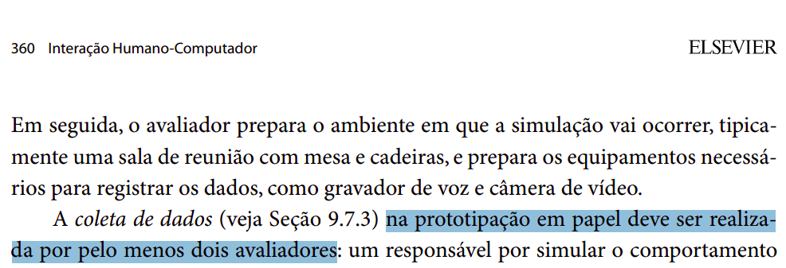 Página: 360, Capítulo 10. Métodos de Avaliação de IHC. Livro: SIMONE DINIZ JUNQUEIRO BARBOSA, BRUNO SANTANA DA SILVA, Interação Humano-Computador, 1a. Edição, Editora Campus, 2010. Publicado em: 03/05/2021.   |
| 2    | A avaliação teve um responsável por simular o comportamento do sistema e outro por observar a experiência de uso? |  Não.     | 1.0, 15/01/2025 às 21:00   |  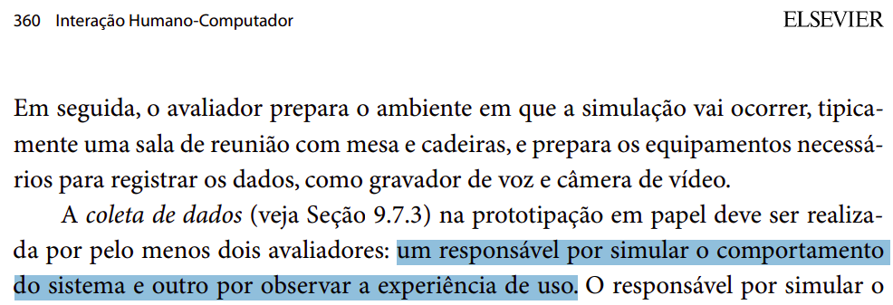 Página: 360, Capítulo 10. Métodos de Avaliação de IHC. Livro: SIMONE DINIZ JUNQUEIRO BARBOSA, BRUNO SANTANA DA SILVA, Interação Humano-Computador, 1a. Edição, Editora Campus, 2010. Publicado em: 03/05/2021. |
| 3    | O responsável por simular o sistema busca compreender as ações do usuário sobre o protótipo em papel e possivelmente as intenções que motivaram tais ações? |  Sim.  |  1.0, 15/01/2025 às 21:00 | 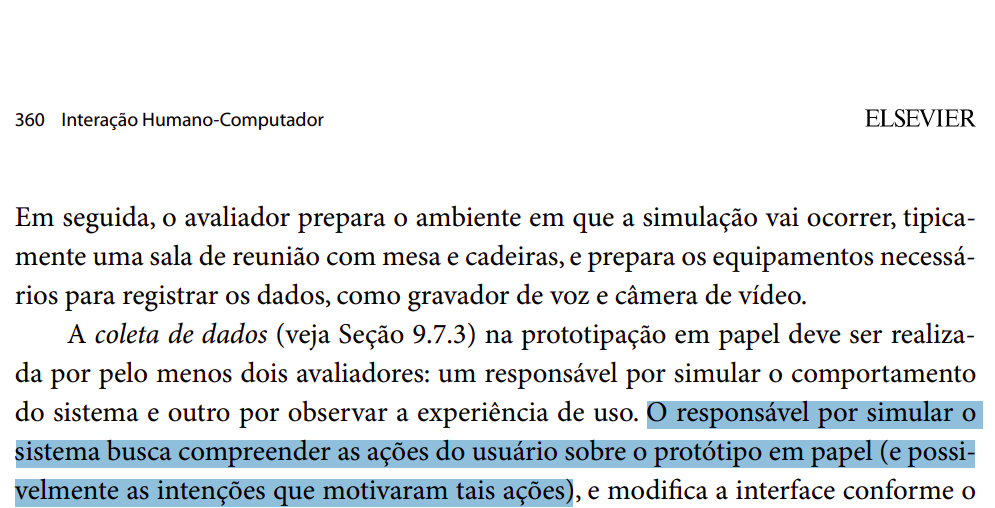 Página: 360, Capítulo 10. Métodos de Avaliação de IHC. Livro: SIMONE DINIZ JUNQUEIRO BARBOSA, BRUNO SANTANA DA SILVA, Interação Humano-Computador, 1a. Edição, Editora Campus, 2010. Publicado em: 03/05/2021. |
| 4    | O responsável por simular o sistema modifica a interface conforme o comportamento planejado para o sistema, sem, no entanto, fornecer explicações ou orientações para o usuário? | Sim. | 1.0, 15/01/2025 às 21:00 |  Página: 360, Capítulo 10. Métodos de Avaliação de IHC. Livro: SIMONE DINIZ JUNQUEIRO BARBOSA, BRUNO SANTANA DA SILVA, Interação Humano-Computador, 1a. Edição, Editora Campus, 2010. Publicado em: 03/05/2021. |
| 5    | Tudo o que for necessário informar ao usuário está representado na interface do sistema?  |  Sim.     |     1.0, 15/01/2025 às 21:00          | 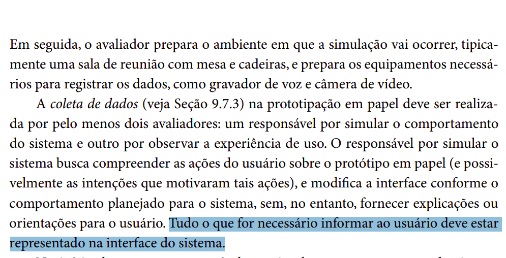 Página: 360, Capítulo 10. Métodos de Avaliação de IHC. Livro: SIMONE DINIZ JUNQUEIRO BARBOSA, BRUNO SANTANA DA SILVA, Interação Humano-Computador, 1a. Edição, Editora Campus, 2010. Publicado em: 03/05/2021. |
| 6    | No início da sessão, o responsável por simular o comportamento do sistema apresenta o protótipo em papel e explica como estão representados os elementos de interface (widgets) e como os participantes podem “interagir” com eles? |   Sim.    |     1.0, 15/01/2025 às 21:00       | 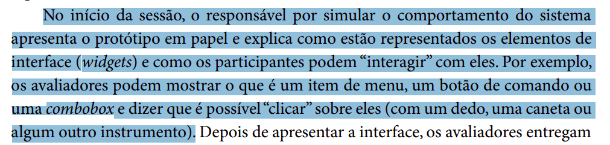 Página: 360, Capítulo 10. Métodos de Avaliação de IHC. Livro: SIMONE DINIZ JUNQUEIRO BARBOSA, BRUNO SANTANA DA SILVA, Interação Humano-Computador, 1a. Edição, Editora Campus, 2010. Publicado em: 03/05/2021. |
| 7    | Depois de apresentar a interface, os avaliadores entregam os cenários ao participante e explicam as tarefas a serem executadas? |  Sim.     |    1.0, 15/01/2025 às 21:00      |  Página: 360, Capítulo 10. Métodos de Avaliação de IHC. Livro: SIMONE DINIZ JUNQUEIRO BARBOSA, BRUNO SANTANA DA SILVA, Interação Humano-Computador, 1a. Edição, Editora Campus, 2010. Publicado em: 03/05/2021. |
| 8    | O avaliador modifica a interface com base nas interações do usuário?                      |   Sim.    |     1.0, 15/01/2025 às 21:00          | 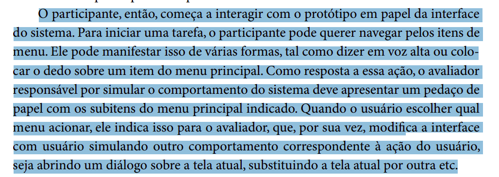 Página: 360, Capítulo 10. Métodos de Avaliação de IHC. Livro: SIMONE DINIZ JUNQUEIRO BARBOSA, BRUNO SANTANA DA SILVA, Interação Humano-Computador, 1a. Edição, Editora Campus, 2010. Publicado em: 03/05/2021. |
| 9    | Durante a simulação da interação, o observador está atento às partes da interface que funcionaram bem e que funcionaram mal, quais tarefas foram concluídas com sucesso, quais erros foram cometidos, quais comentários foram feitos e quaisquer outros dados que auxiliem a apreciar a qualidade da interface? |    Sim.   |      1.0, 15/01/2025 às 21:00         |  Página: 360, Capítulo 10. Métodos de Avaliação de IHC. Livro: SIMONE DINIZ JUNQUEIRO BARBOSA, BRUNO SANTANA DA SILVA, Interação Humano-Computador, 1a. Edição, Editora Campus, 2010. Publicado em: 03/05/2021. |
| 10   | Os avaliadores realizaram uma entrevista pós-teste para colher a opinião do participante sobre o protótipo da interface e sugestões de melhorias? |   Incompleto.    |    1.0, 15/01/2025 às 21:00   |  Páginas: 360 e 361, Capítulo 10. Métodos de Avaliação de IHC. Livro: SIMONE DINIZ JUNQUEIRO BARBOSA, BRUNO SANTANA DA SILVA, Interação Humano-Computador, 1a. Edição, Editora Campus, 2010. Publicado em: 03/05/2021. |
| 11   | A partir da análise dos avaliadores após a avaliação, foi feita uma lista de problemas na interface que devem ser corrigidos, além de indicações de partes do sistema que podem ser aperfeiçoadas? |   Incompleto.    |       1.0, 15/01/2025 às 21:00        | 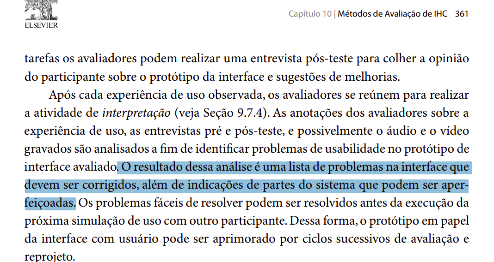 Página: 361, Capítulo 10. Métodos de Avaliação de IHC. Livro: SIMONE DINIZ JUNQUEIRO BARBOSA, BRUNO SANTANA DA SILVA, Interação Humano-Computador, 1a. Edição, Editora Campus, 2010. Publicado em: 03/05/2021. |
| 12   | Os problemas fáceis de resolver foram resolvidos antes da execução da próxima simulação de uso com outro participante? |   Não.    |     1.0, 15/01/2025 às 21:00    |  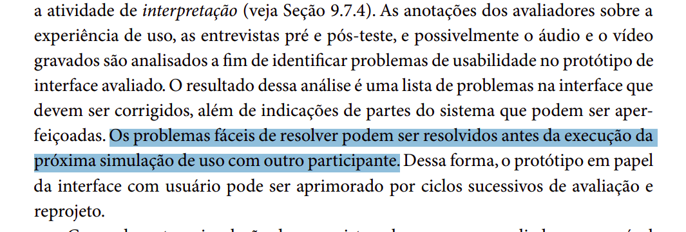 Página: 361, Capítulo 10. Métodos de Avaliação de IHC. Livro: SIMONE DINIZ JUNQUEIRO BARBOSA, BRUNO SANTANA DA SILVA, Interação Humano-Computador, 1a. Edição, Editora Campus, 2010. Publicado em: 03/05/2021.   |

Autor(es): [Felipe Rodrigues](https://github.com/felipeJRdev), 2025.

**Figura 5** - Gráfico das respostas avaliadas na entrega 6 

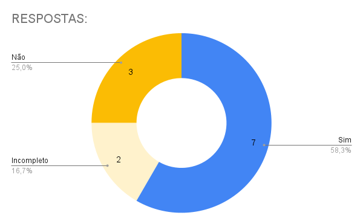

Autor(es): [Felipe Rodrigues](https://github.com/felipeJRdev), 2025.

## Entrega 07

**Tabela 6** - Aspectos avaliados na entrega 7.

| Item | Pergunta                                                                                   | Resposta | Versão, data e horário da avaliação | Referência |
|------|-------------------------------------------------------------------------------------------|----------|--------------------------------------|-------------|
| 1    | O protótipo de alta fidelidade incorpora decisões sobre tamanhos, posições, cores, fontes e outros detalhes visuais? | Sim |  1.0, 27/01/2025 às 21:20  |  Página: 210, Capítulo 9.4. Design da Interface. Livro: Barbosa, S. D. J.; Silva, B. S. da; Silveira, M. S.; Gasparini, I.; Darin, T.; Barbosa, G. D. J. (2021) Interação Humano-Computador e Experiência do usuário. Autopublicação. |
| 2    | As ferramentas utilizadas para criar o protótipo de alta fidelidade foram mencionadas? | Não | 1.0, 27/01/2025 às 21:20|  Página: 210, Capítulo 9.4. Design da Interface. Livro: Barbosa, S. D. J.; Silva, B. S. da; Silveira, M. S.; Gasparini, I.; Darin, T.; Barbosa, G. D. J. (2021) Interação Humano-Computador e Experiência do usuário. Autopublicação. |
| 3    | Foram coletados registros adicionais como vídeos de interação, teclas digitadas ou comentários em áudio dos participantes? | Sim | 1.0, 27/01/2025 às 21:20 | 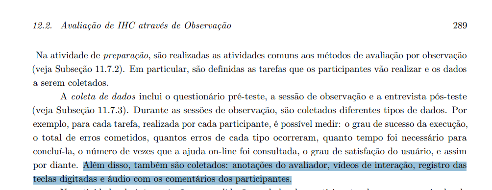 Página: 289, Capítulo 12.2. Avaliação de IHC através de Observação. Livro: Barbosa, S. D. J.; Silva, B. S. da; Silveira, M. S.; Gasparini, I.; Darin, T.; Barbosa, G. D. J. (2021) Interação Humano-Computador e Experiência do usuário. Autopublicação.|
| 4    | O desempenho dos participantes foi observado e medido, incluindo o número de erros, tempo de execução? | Sim | 1.0, 27/01/2025 às 21:20 | 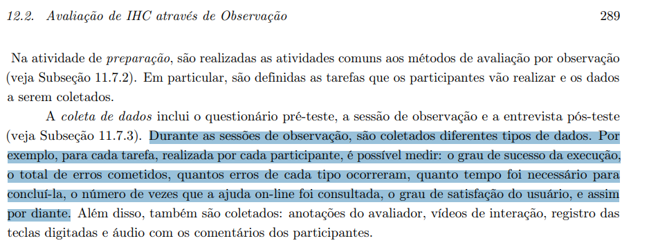  Página: 289, Capítulo 12.2. Avaliação de IHC através de Observação. Livro: Barbosa, S. D. J.; Silva, B. S. da; Silveira, M. S.; Gasparini, I.; Darin, T.; Barbosa, G. D. J. (2021) Interação Humano-Computador e Experiência do usuário. Autopublicação.|
| 5    | Foram identificados e categorizados os problemas encontrados na interação dos usuários com o protótipo? | Sim | 1.0, 27/01/2025 às 21:20 |  Página: 289, Capítulo 12.2. Avaliação de IHC através de Observação. Livro: Barbosa, S. D. J.; Silva, B. S. da; Silveira, M. S.; Gasparini, I.; Darin, T.; Barbosa, G. D. J. (2021) Interação Humano-Computador e Experiência do usuário. Autopublicação.|
| 6    | Para cada problema observado, os entrevistadores elaboraram explicações sobre as causas e propôs sugestões de melhorias? | Sim | 1.0, 27/01/2025 às 21:20 | 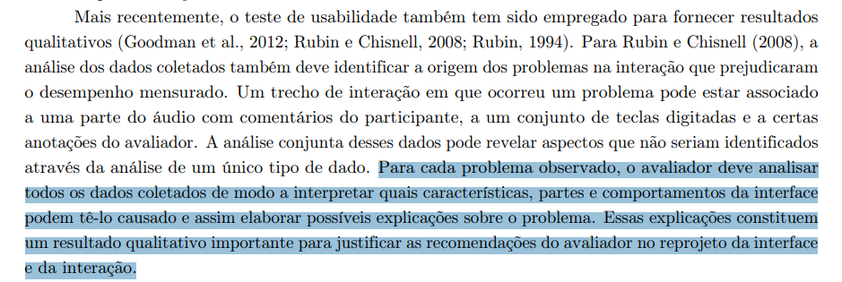 Página: 289, Capítulo 12.2. Avaliação de IHC através de Observação. Livro: Barbosa, S. D. J.; Silva, B. S. da; Silveira, M. S.; Gasparini, I.; Darin, T.; Barbosa, G. D. J. (2021) Interação Humano-Computador e Experiência do usuário. Autopublicação.|
| 7    | O relato apresenta os dados em tabelas para análise? | Sim |  1.0, 27/01/2025 às 21:20 |  Página: 289, Capítulo 12.2. Avaliação de IHC através de Observação. Livro: Barbosa, S. D. J.; Silva, B. S. da; Silveira, M. S.; Gasparini, I.; Darin, T.; Barbosa, G. D. J. (2021) Interação Humano-Computador e Experiência do usuário. Autopublicação.|

Autor(es): [Felipe Rodrigues](https://github.com/felipeJRdev), 2025.

**Figura 6** - Gráfico das respostas avaliadas na entrega 7. 

Autor(es): [Felipe Rodrigues](https://github.com/felipeJRdev), 2025.

## Referência Bibliográfica

BARBOSA, Simone Diniz Junqueira; SILVA, Bruno Santana da. *Interação Humano-Computador*. Rio de Janeiro: Elsevier, 2010.  

## Bibliografia

SILVA, André Barros. Plano de Ensino - FIHC 022024 Turma 01 v1. Interação Humano Computador, 2° semestre de 2024. Disponível em: [Plano de Ensino](https://aprender3.unb.br/pluginfile.php/2972625/mod_resource/content/56/Plano_de_Ensino%20FIHC%20022024%20Turma%2001%20v1.pdf).

## Histórico de Versões

**Tabela 4** - Histórico de versões.

| Versão | Descrição | Autor(es) | Data | Revisor(es) | Data de revisão |
| :----: | :-------: | :-------: | :--: | :-------------------------------: | :-------------: |
|  1.0   | Realização da avaliação | [Ruan Carvalho](https://github.com/Ruan-Carvalho) | 13/11/2024 | [Marcelo Adrian](https://github.com/Marcelo-Adrian) |   13/11/2024   |
|  1.1   | Reavaliação após feedback | [Marcelo Adrian](https://github.com/Marcelo-Adrian) | 24/11/2024 | [Felipe Rodrigues](https://github.com/felipeJRdev) |   24/11/2024   |
|  1.2   | Padronização de Referências Bibliográficas, Bibliografia e Autor(es)|[Felipe Rodrigues](https://github.com/felipeJRdev)|23/11/2024|  [Marcelo Adrian](https://github.com/Marcelo-Adrian) |  24/11/2024 |
|  1.3   | Adição da avaliação do grupo +1, etapa 2 e 3 | [João Vitor](https://github.com/Jauzimm) | 04/12/2024 | [Ruan Carvalho](https://github.com/Ruan-Carvalho) | 04/12/2024 |
|  1.4   | Realização da avaliação 4 | [Ruan Carvalho](https://github.com/Ruan-Carvalho) | 11/12/2024 | [Marcelo Adrian](https://github.com/Marcelo-Adrian) | 11/12/2024 |
|  1.4   | Realização da avaliação 6 | [Felipe Rodrigues](https://github.com/felipeJRdev)| 15/01/2025 | [Marcelo Adrian](https://github.com/Marcelo-Adrian) | 15/01/2025 |
|  1.5   | Realização da avaliação 7 | [Felipe Rodrigues](https://github.com/felipeJRdev)| 27/01/2025 | | |
