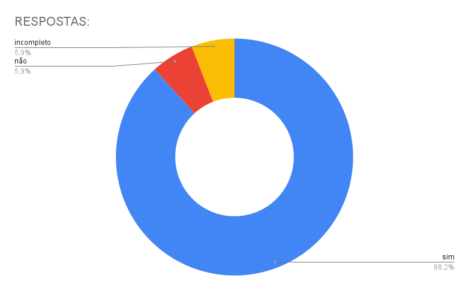

# Avaliação do grupo + 1 (Grupo 06)

## Introdução
Neste documento está contido a avaliação do grupo 06 acerca de primeira entrega do projeto da disciplina de Interação Humano-Computador. 

## Video de primeira avaliação

<iframe width="560" height="315" src="https://www.youtube.com/embed/1YF_VGZcrNM?si=6qIOqVE_-W7FWPR5" title="YouTube video player" frameborder="0" allow="accelerometer; autoplay; clipboard-write; encrypted-media; gyroscope; picture-in-picture; web-share" referrerpolicy="strict-origin-when-cross-origin" allowfullscreen></iframe>

**Link:** [Avaliação do grupo + 1](https://www.youtube.com/watch?v=1YF_VGZcrNM)

## Aspectos avaliados na primeira entrega

**Tabela 1** - Aspectos avaliados na entrega 1.

| | O github pages possui: | Resposta | Versão, data e horário da avaliação |
|-|------------------------|----------|-------------------------------------|
| **Itens do Planejamento Geral do projeto.** | 1 – Uma página apresentando os integrantes da equipe (com foto) com nome e sem matrícula? | Sim | 1.0, 13/11/2024, 16:00 |
| | 2 - O cronograma do planejamento apresenta todas as atividades de todas as etapas para cada integrante com as datas de início e fim das entrega dos artefatos e com o período da revisão deles? | Sim | 1.3, 13/11/2024, 16:08 |
| | 3 - O cronograma do planejamento apresenta um período de gravação da apresentação de cada etapa. | Sim | 1.3, 13/11/2024, 16:09 |
| | 4 - O cronograma prevê um período de revisão/ajustes nos artefatos devido às considerações dos monitores/professor? | Sim | 1.4.1, 24/11/2024, 18:40 |
| | 5 - A motivação e os critérios para a escolha do site? | Sim | 1.1, 13/11/2024, 19:05 |
| | 6 - O planejamento e avaliação dos sites selecionados? | Incompleto | 1.2, 24/11/2024, 18:43 |
| | 7 - Possui opção de contraste de cores? | Sim | 1.0, 13/11/2024, 19:14 |
| | 8 – Os artefatos: Planejamento do Projeto, equipe, lista de sites avaliados, site selecionado para o projeto da disciplina, Ferramentas do projeto, Processo de Design, cronograma das atividades? | Sim | 1.0, 13/11/2024, 19:17 |
| **Itens do Desenvolvimento do projeto.** | 1 - O histórico de versão padronizado?| Sim | 1.0, 13/11/2024, 19:17 |
| | 2 – O(s) autor(es) e o(s) revisor(es) para cada artefato? | Incompleto | 1.0, 24/11/2024, 18:53 |
| | 3 - Referências bibliográficas e/ou bibliografia em todos os artefatos? | Sim | 1.0, 13/11/2024, 19:23 |
| | 4 - As tabelas e imagens possuem legenda e fonte e elas são chamadas dentro dos textos? | Incompleto | 1.0, 24/11/2024, 18:48 |
| | 5 - Um texto fazendo uma introdução dos artefatos? | Sim | 1.0, 13/11/2024, 19:25 |
| | 6 - O cronograma executado com quem realizou cada artefato/atividade com as datas de início e fim da construção/realização do artefato/atividade. | Sim | 1.4.1, 24/11/2024, 18:49 |
| | 7 - Ata(s) da(s) reuniões (com data, horário de início e do final, participantes, objetivo, atividades definidas etc). | Sim | 1.1, 13/11/2024, 19:27 |
| | 8 – A gravação da reunião do grupo. | Sim | 1.1, 13/11/2024, 19:28 |
| | 9 - Vídeo de apresentação na categoria “não listado” no YouTube? | Sim | 1.0, 13/11/2024, 19:30 |
| **Itens do conteúdo da disciplina.** | A justificativa da escolha do Processo de Design? | Sim | 1.0, 13/11/2024, 20:34 |

Autor(es): [Ruan Carvalho](https://github.com/Ruan-Carvalho) e [Marcelo Adrian](https://github.com/Marcelo-Adrian), 2024

**Figura 1** - Gráfico das respostas avaliadas na entrega 1 

Autor(es): [Marcelo Adrian](https://github.com/Marcelo-Adrian), 2024

### Entrega 2

<iframe width="560" height="315" src="https://www.youtube.com/embed/TkDQqxaD0DE?si=6qIOqVE_-W7FWPR5" title="YouTube video player" frameborder="0" allow="accelerometer; autoplay; clipboard-write; encrypted-media; gyroscope; picture-in-picture; web-share" referrerpolicy="strict-origin-when-cross-origin" allowfullscreen></iframe>

**Link:** [Avaliação do grupo + 1](https://youtu.be/TkDQqxaD0DE)

**Tabela 2** - Aspectos avaliados na entrega 2.

| | O github pages possui: | Resposta | Versão, data e horário da avaliação |
|-|------------------------|----------|-------------------------------------|
| **Itens do Desenvolvimento do projeto.** | 1 - O histórico de versão padronizado?| Sim | 1.3, 04/12/2024, 18:00 |
| | 2 – O(s) autor(es) e o(s) revisor(es) para cada artefato? | Incompleto | 1.4.1, 04/12/2024, 18:01 |
| | 3 - Referências bibliográficas e/ou bibliografia em todos os artefatos? | Sim | 1.3, 04/12/2024, 18:08 |
| | 4 - As tabelas e imagens possuem legenda e fonte e elas são chamadas dentro dos textos? | Sim | 1.3, 04/12/2024, 18:13 |
| | 5 - Um texto fazendo uma introdução dos artefatos? | Sim | 1.3, 04/12/2024, 18:13  |
| | 6 - O cronograma executado com quem realizou cada artefato/atividade com as datas de início e fim da construção/realização do artefato/atividade. | Sim | 1.4.1, 04/12/2024, 18:16 |
| | 7 - Ata(s) da(s) reuniões (com data, horário de início e do final, participantes, objetivo, atividades definidas etc). | Sim | 1.0, 04/12/2024, 18:17 |
| | 8 – A gravação da reunião do grupo. | Não | 1.0, 04/12/2024, 18:18 |
| | 9 - Vídeo de apresentação na categoria “não listado” no YouTube? | Sim | 1.0, 04/12/2024, 18:19 |
| Itens do conteúdo da disciplina.  | 10 - O perfil do usuário? | Sim | 1.4, 04/12/2024, 18:20 |
| | 11 - O perfil do usuário possui os atributos de um perfil. | Sim | 1.4, 04/12/2024, 18:21 |
| | 12 - O perfil do usuário define os grupos de atributos apresentados no capítulo 8 - Organização do Espaço de Problema. | Incompleto | 1.4, 04/12/2024, 18:21 |
| | 13 - Considera aspectos Éticos de Pesquisas Envolvendo Pessoas? | Sim | 1.1, 04/12/2024, 18:27 |
| | 14 - Os 4 princípios (da autonomia, da beneficência, princípio da não maleficência e da justiça e equidade)  | Sim | 1.1, 04/12/2024, 18:28 |
| | 15 - que solicitará a permissão para gravar a voz ou imagem de qualquer pessoa, antes de começar a gravação? | Sim | 1.1, 04/12/2024, 18:30 |
| | 16 - O termo de consentimento livre e esclarecido dos participantes? | Sim | 1.1, 04/12/2024, 18:30 |
| | 17 - Foram utilizadas no mínimo duas técnicas para coletar dados e levantar os requisitos dos usuários (quanto mais melhor)? | Sim | 1.4, 04/12/2024, 18:30 |
| | 18 - Os Cenários? | Sim | 1.4, 04/12/2024, 18:31 |
| | 19 - a Análise de tarefas? | Sim | 1.6, 04/12/2024, 18:31 |
| | 20 - uma atividade para cada integrante do grupos que deve estar modelizado em ao menos duas técnicas para especificar as tarefas? | Sim | 1.6, 04/12/2024, 18:32 |
| | 21 - Utilizaram alguma técnica para especificar as tarefas?  | Sim | 1.6, 04/12/2024, 18:32 |

Autor(es): [João Vitor](https://github.com/Jauzimm), 2024

**Figura 2** - Gráfico das respostas avaliadas na entrega 2 

Autor(es): [Ruan Carvalho](https://github.com/Ruan-Carvalho), 2024

### Entrega 3

<iframe width="560" height="315" src="https://www.youtube.com/embed/S3_gdCTLAyU?si=6qIOqVE_-W7FWPR5" title="YouTube video player" frameborder="0" allow="accelerometer; autoplay; clipboard-write; encrypted-media; gyroscope; picture-in-picture; web-share" referrerpolicy="strict-origin-when-cross-origin" allowfullscreen></iframe>

**Link:** [Avaliação do grupo + 1](https://youtu.be/S3_gdCTLAyU)

**Tabela 3** - Aspectos avaliados na entrega 3.

| | O github pages possui: | Resposta | Versão, data e horário da avaliação |
|-|------------------------|----------|-------------------------------------|
| **Itens do Desenvolvimento do projeto.** | 1 - O histórico de versão padronizado?| Sim | 1.0, 04/12/2024, 19:02 |
| | 2 – O(s) autor(es) e o(s) revisor(es) para cada artefato? | Incompleto | 1.4.1, 04/12/2024, 18:01 |
| | 3 - Referências bibliográficas e/ou bibliografia em todos os artefatos? | Sim | 1.3, 04/12/2024, 18:08 |
| | 4 - As tabelas e imagens possuem legenda e fonte e elas são chamadas dentro dos textos? | Sim | 1.3, 04/12/2024, 18:13 |
| | 5 - Um texto fazendo uma introdução dos artefatos? | Sim | 1.3, 04/12/2024, 18:13  |
| | 6 - O cronograma executado com quem realizou cada artefato/atividade com as datas de início e fim da construção/realização do artefato/atividade. | Sim | 1.4.1, 04/12/2024, 18:16 |
| | 7 - Ata(s) da(s) reuniões (com data, horário de início e do final, participantes, objetivo, atividades definidas etc). | Sim | 1.0, 04/12/2024, 18:17 |
| | 8 – A gravação da reunião do grupo. | Não | 1.0, 04/12/2024, 18:18 |
| | 9 - Vídeo de apresentação na categoria “não listado” no YouTube? | Sim | 1.0, 04/12/2024, 18:19 |
| | 10 - As características da plataforma para o projeto | Sim | 1.0, 04/12/2024, 19:07 | 
| | 11 - Os Princípios Gerais do Projeto que serão utilizados no projeto? | Sim | 1.0, 04/12/2024, 19:07 | 
| | 12 - Os Princípios Gerais do Projeto contém os seguintes tópicos?  1- correspondência com as expectativas dos usuários; 2- simplicidade nas estruturas das tarefas; 3- equilíbrio entre controle e liberdade do usuário 4- consistência e padronização; promoção da eficiência do usuário; 5- antecipação das necessidades do usuário; 6 - visibilidade e reconhecimento; 7- conteúdo relevante e expressão adequada; 8 - projeto para erros.| Sim | 1.0, 04/12/2024, 19:07 | 
| | 13 - As metas de usabilidade que devem ser alcançadas no projeto ou os objetivos de uma avaliação de IHC. | Sim | 1.1, 04/12/2024, 19:09 | 
| | 14 - A razão da seleção das metas de usabilidade? | Sim | 1.1, 04/12/2024, 19:09 |
| | 15 - O Guia de Estilo do projeto? | Sim | 1.1, 04/12/2024, 19:10 |
| | 16 - O Guia de Estilo do projeto possui a seguinte estrutura:   • 1. Introdução (com Objetivo do guia de estilo, Organização e conteúdo do guia de estilo, Público-alvo do guia de estilos (programadores, gerentes, equipe de suporte), Como utilizar o guia (em produção e manutenção), Como manter o guia • 2. Resultados de análise • Descrição do ambiente de trabalho do usuário • 3. Elementos de interface • Disposição espacial e grid • Janelas • Tipografia • Cores • 4. Elementos de interação - • Estilos de interação • Seleção de um estilo • Aceleradores (teclas de atalho) • 5. Elementos de ação • Preenchimento de campos • Seleçã • Ativação • 6. Vocabulário e padrões • Terminologia • Tipos de tela (para tarefas comuns) • Sequências de diálogos (e.g., para feedback ou confirmação de uma operação) | Sim | 1.1, 04/12/2024, 19:13 |
| | 17 - O Guia de Estilo corresponde ao site avaliado? | Sim | 1.1, 04/12/2024, 19:15 |

Autor(es): [João Vitor](https://github.com/Jauzimm), 2024.

**Figura 3** - Gráfico das respostas avaliadas na entrega 3 

Autor(es): [Ruan Carvalho](https://github.com/Ruan-Carvalho), 2024

## Bibliografia

SILVA, André Barros. Plano de Ensino - FIHC 022024 Turma 01 v1. Interação Humano Computador, 2° semestre de 2024. Disponível em: [Plano de Ensino](https://aprender3.unb.br/pluginfile.php/2972625/mod_resource/content/56/Plano_de_Ensino%20FIHC%20022024%20Turma%2001%20v1.pdf).

## Histórico de Versões

**Tabela 4** - Histórico de versões.

| Versão | Descrição | Autor(es) | Data | Revisor(es) | Data de revisão |
| :----: | :-------: | :-------: | :--: | :-------------------------------: | :-------------: |
|  1.0   | Realização da avaliação | [Ruan Carvalho](https://github.com/Ruan-Carvalho) | 13/11/2024 | [Marcelo Adrian](https://github.com/Marcelo-Adrian) |   13/11/2024   |
|  1.1   | Reavaliação após feedback | [Marcelo Adrian](https://github.com/Marcelo-Adrian) | 24/11/2024 | [Felipe Rodrigues](https://github.com/felipeJRdev) |   24/11/2024   |
|  1.2   | Padronização de Referências Bibliográficas, Bibliografia e Autor(es)|[Felipe Rodrigues](https://github.com/felipeJRdev)|23/11/2024|  [Marcelo Adrian](https://github.com/Marcelo-Adrian) |  24/11/2024 |
|  1.3   | Adição da avaliação do grupo +1, etapa 2 e 3 | [João Vitor](https://github.com/Jauzimm) | 04/12/2024 | [Ruan Carvalho](https://github.com/Ruan-Carvalho) | 04/12/2024 |

