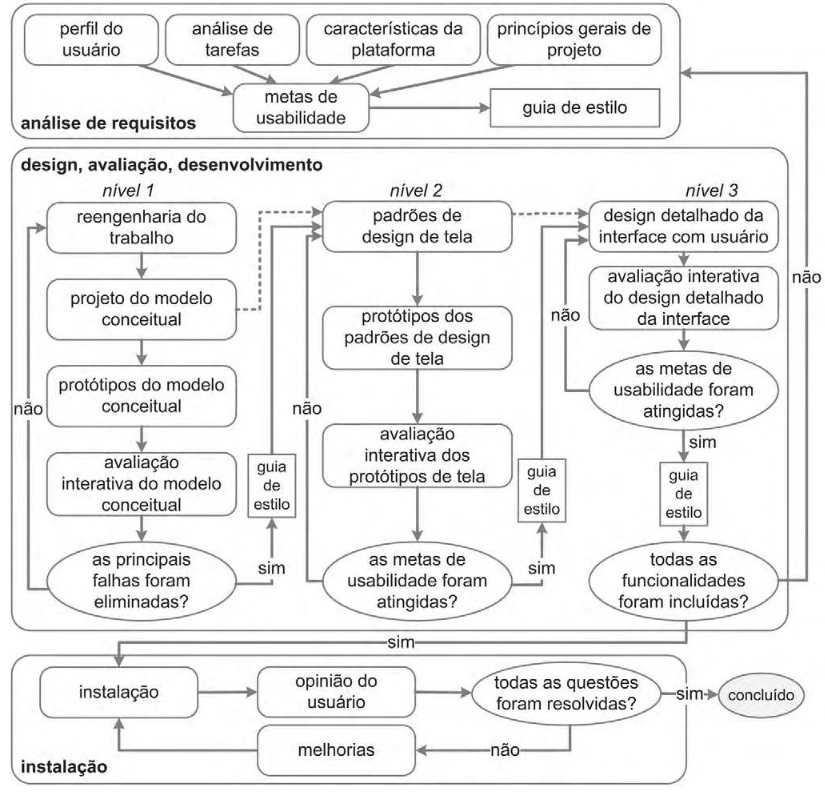

# Entrega Final do Projeto

## Introdução

Este projeto foi desenvolvido no contexto da disciplina de Interação Humano-Computador (IHC), com o objetivo de aplicar os conceitos e princípios estudados na análise e melhoria de um sistema real. Através da aplicação de metodologias de design centrado no usuário e avaliações heurísticas, buscamos identificar problemas de usabilidade e propor soluções que tornem a interação mais eficiente, intuitiva e agradável para os usuários. O trabalho envolve desde a escolha do site a ser analisado até a execução de melhorias e avaliação dos resultados obtidos.

## Metodologia

A metodologia adotada neste projeto foi baseada em abordagens de design centrado no usuário, combinando inspeções heurísticas, entrevistas com usuários e prototipagem iterativa. Inicialmente, realizamos a seleção do site e justificamos a escolha com base em critérios de relevância e potencial de melhoria. Em seguida, aplicamos o ciclo de vida escolhido para o projeto, documentando cada etapa, desde o planejamento até a execução e avaliação.

As técnicas de avaliação utilizadas incluíram testes com usuários, feedback qualitativo e quantitativo, além de verificações internas entre os membros da equipe. Ferramentas específicas foram empregadas em diferentes fases do projeto, desde a prototipagem até a análise dos resultados, garantindo uma abordagem completa e estruturada para o desenvolvimento das soluções propostas.

## 1. O site selecionado para o projeto

O site escolhido para este projeto foi o MOJ Naquadah. A seleção foi feita com base em critérios que destacaram sua relevância e o potencial para melhorias significativas em termos de usabilidade e interação.

## Critérios para escolha

- Facilidade de contato com o público-alvo, composto majoritariamente por membros da UnB.
- Interface fora dos padrões estudados na disciplina, oferecendo desafios interessantes para análise.
- Acessibilidade ao criador do aplicativo, professor Bruno Ribas da UnB, facilitando o feedback direto.
- Facilidade de acesso ao site para os avaliadores.

## Motivação

A escolha do MOJ Naquadah foi motivada por sua importância educacional, sendo amplamente utilizado por alunos e professores. O projeto ofereceu uma oportunidade de desenvolver habilidades computacionais e de resolução de problemas, além de identificar melhorias na interação e usabilidade, focando nas dificuldades de navegação e entendimento da interface para aprimorar a experiência do usuário.

## Problemas encontrados

Utilizando as heurísticas de Nielsen, foram identificados os seguintes problemas no site:

1. **Correspondência entre o sistema e o mundo real:** O formato das datas não segue padrões intuitivos, dificultando a leitura.
2. **Consistência e padronização:** A navegação superior redireciona para sites externos, contrariando expectativas dos usuários.
3. **Flexibilidade e eficiência de uso:** Botões laterais não são intuitivos para retornar ao menu principal, dificultando a navegação.
4. **Projeto estético e minimalista:** Cores e elementos visuais dificultam a leitura e interpretação rápida das informações.
5. **Prevenção de erros:** Falta de alertas sobre a perda de envios ao trocar de questão.
6. **Mensagens de erro claras:** Mensagens de erro no login não especificam corretamente os problemas.
7. **Ajuda e documentação:** FAQ e documentação não cobrem todas as dúvidas técnicas relevantes.

## 2. O ciclo de vida utilizado no projeto

O processo de design escolhido pela equipe foi a Engenharia de Usabilidade de Mayhew, que se divide em três principais etapas: Análise de Requisitos, Design e Avaliação, além de Desenvolvimento e Instalação. A escolha deste processo se deu por sua abordagem completa e detalhada, que facilita o planejamento e a execução do projeto.

**Figura 1** - Ciclo de vida de Mayhew.

**Fonte**: (Capítulo 4, ítem 4.3.3, Figura 4.7, página 110, Interação Humano-Computador Elsevier, Simone Barbosa e Bruno Santana, 2010)

Este ciclo de vida foi particularmente adequado porque abrange todas as fases necessárias para a melhoria de um sistema já existente, como é o caso do CD-MOJ Naquadah. Incorporamos a etapa de instação, fases de design, avaliação e desenvolvimento para ajustar e testar as melhorias propostas. As etapas que envolvem a criação do sistema do zero não foram aplicadas, já que o foco da disciplina está na análise e otimização de uma interface existente.

O ciclo de Mayhew proporcionou uma estrutura sólida para garantir que todas as mudanças fossem fundamentadas em análises rigorosas e avaliações constantes, promovendo um processo iterativo de melhorias contínuas.

## 3. O planejamento dos recursos e das entregas
(Cronograma planejado e executado)

## 4. A execução do projeto

A execução do projeto seguiu as etapas definidas no ciclo de vida da Engenharia de Usabilidade de Mayhew. Cada fase foi documentada com os artefatos correspondentes, permitindo um acompanhamento detalhado do progresso e das decisões tomadas.

## Análise de Requisitos

Nesta etapa, realizamos a identificação das necessidades dos usuários e das principais limitações do site. Foram aplicadas entrevistas, questionários e análises heurísticas para levantar informações relevantes.

- [Perfil do Usuário](https://interacao-humano-computador.github.io/2024.2-CDMOJ/entregas/entrega_2/perfil/);
- [Análise de Tarefas HTA](https://interacao-humano-computador.github.io/2024.2-CDMOJ/entregas/entrega_2/analise_de_tarefas/HTA/) e [GOMS](https://interacao-humano-computador.github.io/2024.2-CDMOJ/entregas/entrega_2/analise_de_tarefas/GOMS/);
- [Característica da Plataforma](https://interacao-humano-computador.github.io/2024.2-CDMOJ/entregas/entrega_2/caracteristicas/);
- [Príncipios Gerais do Projeto](https://interacao-humano-computador.github.io/2024.2-CDMOJ/entregas/entrega_3/principiosGerais/);
- [Metas de Usabilidade](https://interacao-humano-computador.github.io/2024.2-CDMOJ/entregas/entrega_3/metas_de_usabilidade/);
- [Guia de Estilo](https://interacao-humano-computador.github.io/2024.2-CDMOJ/entregas/entrega_2/guia_de_estilo/).

## Design, Avaliação e Desenvolvimento

Com base nos requisitos identificados, desenvolvemos protótipos de baixa e alta fidelidade, explorando soluções para os problemas de usabilidade encontrados. Utilizamos storyboards e análises de tarefas para estruturar o fluxo de interação e orientar o design das interfaces. As entrevistas com os usuários ajudaram a validar essas soluções, proporcionando feedback valioso para os ajustes necessários.

Após o design, implementamos as melhorias no protótipo de alta fidelidade, ajustando a interface e a navegação para aprimorar a experiência do usuário. Os protótipos atualizados do site foram avaliados através de testes com usuários, utilizando métricas de usabilidade e feedback qualitativo. As avaliações permitiram identificar pontos de melhoria, antes do desenvolvimento do protótipo final.

- Storyboard:
    - [Storyboards](https://interacao-humano-computador.github.io/2024.2-CDMOJ/entregas/entrega_4/storyboard/storyboards/);
    - [Planejamento da avaliação](https://interacao-humano-computador.github.io/2024.2-CDMOJ/entregas/entrega_4/storyboard/planejamento_da_avalia%C3%A7%C3%A3o/); 
    - [Planjeamento do relato](https://interacao-humano-computador.github.io/2024.2-CDMOJ/entregas/entrega_4/storyboard/planejamento_do_relato/);
    - [Relatos](https://interacao-humano-computador.github.io/2024.2-CDMOJ/entregas/entrega_5/relato_resultados_storyboard_analise_tarefas/)

- Análise de Tarefas:
    - [Diagramas HTA](https://interacao-humano-computador.github.io/2024.2-CDMOJ/entregas/entrega_2/analise_de_tarefas/HTA/);
    - [Planejamento da avaliação](https://interacao-humano-computador.github.io/2024.2-CDMOJ/entregas/entrega_4/analise_requisitos/planejamento_avaliacao/);    
    - [Planjeamento do relato](https://interacao-humano-computador.github.io/2024.2-CDMOJ/entregas/entrega_4/analise_requisitos/planejamento_relato/);
    - [Relatos](https://interacao-humano-computador.github.io/2024.2-CDMOJ/entregas/entrega_5/relato_resultados_storyboard_analise_tarefas/).

- Protótipo de Papel:
    - [Planejamento avaliação](https://interacao-humano-computador.github.io/2024.2-CDMOJ/entregas/entrega_5/prototipo_papel/planejamento_avaliacao/);
    - [Planejamento relato](https://interacao-humano-computador.github.io/2024.2-CDMOJ/entregas/entrega_5/prototipo_papel/planejamento_relato/);
    - Relatos:
        - [Felipe Rodrigues](https://interacao-humano-computador.github.io/2024.2-CDMOJ/entregas/entrega_6/relatos_de_resultados_prototipo_de_papel/relato_FelipeRodrigues/);
        - [Jéssica Eveline](https://interacao-humano-computador.github.io/2024.2-CDMOJ/entregas/entrega_6/relatos_de_resultados_prototipo_de_papel/relato_JessicaEveline/);
        - [João Vitor](https://interacao-humano-computador.github.io/2024.2-CDMOJ/entregas/entrega_6/relatos_de_resultados_prototipo_de_papel/relato_Jo%C3%A3oVitor/);
        - [Ruan Carvalho](https://interacao-humano-computador.github.io/2024.2-CDMOJ/entregas/entrega_6/relatos_de_resultados_prototipo_de_papel/relato_RuanCarvalho/).

- Protótipo de Alta Fidelidade:
    - [Planejamento avaliação](https://interacao-humano-computador.github.io/2024.2-CDMOJ/entregas/entrega_6/prototipo_alta_fidelidade/planejamento_avaliacao/);
    - [Planejamento relato](https://interacao-humano-computador.github.io/2024.2-CDMOJ/entregas/entrega_6/prototipo_alta_fidelidade/planejamento_relato/);
    - Relatos:
        - [Felipe Rodrigues](https://interacao-humano-computador.github.io/2024.2-CDMOJ/entregas/entrega_7/relatos_de_resultados_prototipos_de_alta_fidelidade/relato_FelipeRodrigues/);
        - [Jéssica Eveline](https://interacao-humano-computador.github.io/2024.2-CDMOJ/entregas/entrega_7/relatos_de_resultados_prototipos_de_alta_fidelidade/relato_JessicaEveline/);
        - [Ruan Carvalho](https://interacao-humano-computador.github.io/2024.2-CDMOJ/entregas/entrega_7/relatos_de_resultados_prototipos_de_alta_fidelidade/relato_RuanCarvalho/).

## Instalação

A versão final do protótipo, com as melhorias implementadas, foi disponibilizada no Figma. Realizamos testes finais para garantir o funcionamento adequado das novas funcionalidades.

- [Link para o artefato de Instalação]

## 5. O(s) resultado(s) alcançado(s) com a execução do projeto
(Em relação ao objetivo do projeto)

## 6. Tabela: Ferramentas utilizadas em cada etapa do projeto

| Etapa do Projeto       | Ferramenta Utilizada      | Descrição da Utilização       |
|-----------------------|---------------------------|-------------------------------|
| Exemplo: Prototipagem | Figma                     | Criação de protótipos de alta fidelidade |

## 7. Tabela: Técnicas utilizadas e responsáveis

| Técnica Utilizada      | Participante(s) Responsável(is) |
|------------------------|---------------------------------|
| Exemplo: Entrevistas   | Nome do participante           |

## 8. Tabela: Artefatos criados por etapa

| Etapa do Projeto       | Artefato Criado               | Autor         | Revisor       |
|------------------------|-------------------------------|---------------|---------------|
| Exemplo: Análise       | Relatório de requisitos       | Nome do autor | Nome do revisor |

## 9. Tabela: Avaliações dos protótipos

| Protótipo Avaliado     | Entrevistadores               | Nº de Participantes | Participantes do Grupo |
|------------------------|-------------------------------|---------------------|------------------------|
| Exemplo: Protótipo 1   | Nome do entrevistador         | 5                   | Nome do participante   |

## 10. Tabela: Verificação dos artefatos

| Artefato Verificado    | Autor                         | Revisor             | Método de Verificação  |
|------------------------|-------------------------------|---------------------|------------------------|
| Exemplo: Checklist     | Nome do autor                 | Nome do revisor     | Checklist              |

## 11. Tabela: Ferramentas e etapas do projeto

| Etapa do Projeto       | Ferramenta Utilizada          | Descrição da Utilização       |
|------------------------|-------------------------------|-------------------------------|
| Exemplo: Testes        | Google Forms                  | Coleta de feedback dos usuários |

## 12. Tabela: Vídeos das apresentações

| Etapa do Projeto       | Participante(s) na Gravação   |
|------------------------|-------------------------------|
| Exemplo: Prototipagem  | Nome do participante         |

## 13. Facilidades e dificuldades encontradas

| Integrante da Equipe   | Facilidades Encontradas       | Dificuldades Encontradas      |
|------------------------|-------------------------------|-------------------------------|
| Nome do integrante     | Descrição da facilidade       | Descrição da dificuldade      |

## Referência Bibliográfica

> BARBOSA, Simone Diniz Junqueira; SILVA, Bruno Santana da. *Interação Humano-Computador*. Rio de Janeiro: Elsevier, 2010.  

## Histórico de Versões

**Tabela 1** - Histórico de versões.

| Versão | Descrição | Autor(es) | Data | Revisor(es) | Data de revisão |
| :----: | :-------: | :-------: | :--: | :-------------------------------: | :-------------: |
|  1.0   | Criação do Documento | [Felipe Rodrigues](https://github.com/felipeJRdev) | 08/02/2025 |  |  |