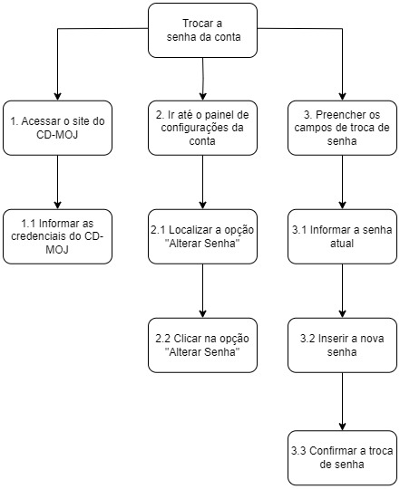
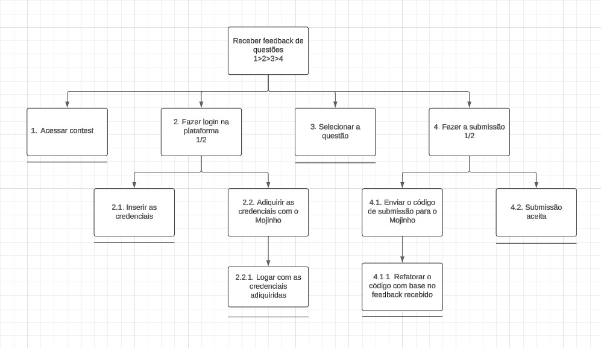

## Introdução

Utilizando a metodologia **HTA (Hierarchical Task Analysis)**, as interações dos usuários com o sistema foram detalhadas, abordando os processos físicos e cognitivos associados às tarefas. A análise baseia-se em princípios de interação humano-computador, que destacam a importância de compreender o contexto de uso, as características humanas e os objetivos dos usuários para desenvolver sistemas mais eficientes e acessíveis. Este trabalho segue uma abordagem sistemática para decompor as tarefas em etapas hierárquicas, promovendo uma visão clara dos processos de interação e suas falhas.

## Metodologia

A análise foi conduzida exclusivamente com a metodologia HTA, alinhada às boas práticas da interação humano-computador, que enfatizam a compreensão do contexto e as características dos usuários para propor soluções centradas neles. 

**HTA (Hierarchical Task Analysis):**

   - **Objetivo:** Identificar e estruturar as etapas e subprocessos que compõem as principais interações dos usuários na plataforma CD-MOJ.
   - **Procedimento:** Cada tarefa foi decomposta em etapas hierárquicas, conectadas por relações de sequência, seleção ou paralelismo.

### **Falta de feedback em tempo real durante a análise de submissões**

#### **Diagrama HTA:**

**Figura 1** - Diagrama HTA Falta de Feedback.

Autor(es): [Felipe Rodrigues](https://github.com/felipeJRdev), 2024.

#### **Legenda do Diagrama:**

- **Tarefa Principal**: A tarefa central a ser alcançada, neste caso, garantir feedback em tempo real durante a análise de submissões.
- **Sub-tarefas**: Dividem o processo em etapas menores que devem ser realizadas para completar a tarefa principal.
- **Setas**: Indicam a sequência de execução das tarefas.
- **Quadrados com linha abaixo**: Indica uma operação que será realizada.

#### **Representação em Tabela (HTA)**

**Tabela 1:** Tabela HTA Falta de feedback.

| **Número da Tarefa** | **Descrição da Tarefa**                                              | **Dependência** |
| -------------------- | -------------------------------------------------------------------- | --------------- |
| 0                    | Falta de feedback em tempo real durante a análise de submissões.                                 | Nenhuma         |
| 1                    | Localizar treino livre.                         | Nenhuma               |
| 1.1                  | Entrar no treino livre.                    | 1               |
| 2                  | Localizar mensagem de instrução para conseguir login e senha.                                           | 1.1             |
| 2.1                    | Clicar para abrir o bot do telegram. | 2             |
| 2.2                    | Realizar login no telegram. | 2.1               |
| 2.3                    |  Enviar comando para o bot no telegram.  |   2.2  |
| 3                    | Utilizar login e senha recebidos do bot para realizar login. | 2.3 |
| 3.1                    | Selecionar o contest para realizar o login. | 3      |
| 3.2                    | Realizar login. | 3.1      |
| 4                    | 4. Submeter um código para avaliação. | 3.2      |
| 4.1                    | 4.1. Clicar em escolher arquivo. | 4      |
| 4.2                    | Encontrar e submeter arquivo. | 4.1      |
| 5                    | Verificar o resultado da análise do código. | 4.1      |
| 5.1                    | Recarregar a página. | 5      |
| 5.2                    | Enviar novamente o arquivo. | 5      |

Autor(es): [Felipe Rodrigues](https://github.com/felipeJRdev), 2024.

### **Troca de senha do usuário**

**Descrição do Diagrama HTA:**

O HTA divide o processo em tarefas hierárquicas e sub-tarefas, mostrando a relação entre as etapas para alcançar o objetivo principal.

#### **Diagrama HTA:**

**Figura 2** - Diagrama Troca de Senha.

Autor(es): [Jéssica Eveline](https://github.com/xzxjesse), 2024.

#### **Legenda do Diagrama:**

- **Tarefa Principal**: A tarefa central a ser alcançada, neste caso, "Trocar a senha da conta".
- **Sub-tarefas**: Dividem o processo em etapas menores que devem ser realizadas para completar a tarefa principal.
- **Setas**: Indicam a sequência de execução das tarefas, com tarefas dependentes.

#### **Representação em Tabela (HTA)**

**Tabela 2:** Tabela HTA Troca de senha.

| **Número da Tarefa** | **Descrição da Tarefa**                        | **Dependência** |
| -------------------- | ---------------------------------------------- | --------------- |
| 1                    | Acessar o site do CD-MOJ.                      | Nenhuma         |
| 1.1                  | Informar as credenciais do CD-MOJ.             | 1               |
| 2                    | Ir até o painel de configurações da conta.     | 1.1             |
| 2.1                  | Localizar a opção "Alterar Senha".             | 2               |
| 2.2                  | Clicar na opção "Alterar Senha".               | 2.1             |
| 3                    | Preencher os campos de troca de senha.         | 2.2             |
| 3.1                  | Informar a senha atual.                        | 3               |
| 3.2                  | Inserir a nova senha.                          | 3.1             |
| 3.3                  | Confirmar a troca de senha.                    | 3.2             |

Autor(es): [Jéssica Eveline](https://github.com/xzxjesse), 2024.

### **Submeter uma questão no treinamento livre.**

#### **Diagrama HTA:**

**Figura 3** - Diagrama Submeter uma questão no treinamento livre.

Autor(es): [João Vitor Santos](https://github.com/Jauzimm), 2024.

#### **Legenda do Diagrama:**

- **Tarefa Principal**: A tarefa principal a ser realizada é submeter uma questão no treino livre.
- **Sub-tarefas**: As tarefas que devem ser realizadas para completar a tarefa principal, divididas em etapas menores.
- **Setas**: Indicam a sequência de execução das tarefas.
- **Quadrados com linha abaixo**: Indica uma operação que será realizada.

#### **Representação em Tabela (HTA)**

**Tabela 3:** Tabela HTA Submeter uma questão no treinamento livre.

| **Número da Tarefa** | **Descrição da Tarefa**                                   | **Dependência** |
| -------------------- | --------------------------------------------------------- | --------------- |
| 0     | Submeter uma questão no treinamento livre. | Nenhuma |
| 1     |  Acessar o treinamento livre.   | Nenhuma |
| 2     | Selecionar a questão de interesse. | 1 |
| 3     | Se cadastrar. | 2 |
| 3.1   | Acessar o mojinho no telegram. | 3 |
| 3.1.1 | Enviar mensagem "participar treino". | 3.1 |
| 3.1.2 | Preencher os dados de cadastro.| 3.1 |
| 3.2   | Preencher os dados de cadastro. | 3 |
| 4   | Selecionar o arquivo | 3 |

Autor(es): [João Vitor Santos](https://github.com/Jauzimm), 2024.

### **Refazer uma questão no historico de questões tentadas**

#### **Diagrama HTA:**

**Figura 4** - Diagrama Refazer uma questão no historico.

Autor(es): [Marcelo Adrian](https://github.com/Marcelo-Adrian), 2024.

#### **Legenda do Diagrama:**

- **Tarefa Principal**: O objetivo principal é revisar competições passadas no CD-MOJ para se preparar para futuros contests.
- **Sub-tarefas**: As etapas menores que o usuário deve seguir para completar a tarefa principal.
- **Setas**: Indicando a sequência de atividades a serem realizadas.

#### **Representação em Tabela (HTA)**

**Tabela 4:** Tabela HTA Falta de mecanismos de busca.

| **Número da Tarefa** | **Descrição da Tarefa**                                                                       | **Dependência** |
| -------------------- | --------------------------------------------------------------------------------------------- | --------------- |
| 1                    | O usuário acessa a aba de conquistas                                                         | Nenhuma         |
| 1.1                  | O usuário acessa o CD-MOJ                                                                    | 1               |
| 1.2                  | O usuário acessa a aba de treino livre                                                       | 1               |
| 1.3                  | O usuário retorna à aba de conquistas                                                        | 1.2             |
| 2                    | O usuário faz login na plataforma                                                            | Nenhuma         |
| 2.1                  | O usuário insere as credenciais manualmente                                                  | 2               |
| 2.2                  | O usuário obtém as credenciais com um bot no Telegram                                         | 2               |
| 2.3                  | O usuário insere as credenciais obtidas pelo bot                                              | 2.2             |
| 3                    | O usuário escolhe uma questão na plataforma                                                  | Nenhuma         |
| 3.1                  | O usuário seleciona a questão desejada na lista                                              | 3               |
| 3.2                  | O usuário refaz a submissão para a questão escolhida                                          | 3.1             |

Autor(es): [Marcelo Adrian](https://github.com/Marcelo-Adrian), 2024.

### **Ausência de informações em submissões erradas**

#### **Diagrama HTA:**

**Figura 5** - Diagrama Ausência de informações em submissões erradas.

Autor(es): [Ruan Carvalho](https://github.com/Ruan-Carvalho), 2024.

#### **Legenda do Diagrama:**

- **Tarefa Principal**: O objetivo é encontrar os casos de teste que geram erros no algoritmo para análise e correção.
- **Sub-tarefas**: São as etapas que o usuário segue para completar a tarefa.
- **Setas**: Indicam a sequência das ações.
- **Quadrados com linha abaixo**: Indica uma operação que será realizada.

#### **Representação em Tabela (HTA)**

**Tabela 5:** Tabela HTA Ausência de informações em submissões erradas.

| **Número da Tarefa** | **Descrição da Tarefa**                                                      | **Dependência** |
| -------------------- | ---------------------------------------------------------------------------- | --------------- |
| 0             | Receber feedback de questões.                 | Nenhuma         |
| 1             | Acessar o contest.                             | 1               |
| 2             | Fazer login na plataforma.    | 1               |
| 2.1           | Inserir as credenciais.   | 2               |
| 2.2           | Adiquirir as credenciais com o mojinho.   | 2               |
| 2.2.1         | Logar com as credenciais adiquiridas. | 2.2               |
| 3             | Selecionar a questão. | 2               |
| 4             | Fazer a submissão. |  3             |
| 4.1           | Enviar o código de submissão para o Mojinho. | 4             |
| 4.1.1         | Refatorar o código com base no feedback recebido. | 4.1             |
| 4.2           | Submissão aceita. | 4             |

Autor(es): [Ruan Carvalho](https://github.com/Ruan-Carvalho), 2024.

## Bibliografia

BARBOSA, Simone Diniz Junqueira; DA SILVA, Bruno Santana. **Planejamento da avaliação de IHC**. In: INTERAÇÃO Humano-Computador. Rio de Janeiro: Elsevier Editora, 2010.

## Histórico de Versão

**Tabela 6:** Histórico de versões.

| Versão |      Descrição       |                                              Autor(es)                                              |    Data    | Revisor(es) | Data de Revisão |
| :----: | :------------------: | :-------------------------------------------------------------------------------------------------: | :--------: | :---------: | :-------------: |
|  1.0   | Criação do documento | [Felipe Rodrigues](https://github.com/felipeJRdev), [Jéssica Eveline](https://github.com/xzxjesse), [João Vitor](https://github.com/Jauzimm), [Ruan Carvalho](https://github.com/Ruan-Carvalho), [Marcelo Adrian](https://github.com/Marcelo-Adrian)| 03/12/2024 |      [Felipe Rodrigues](https://github.com/felipeJRdev), [Jéssica Eveline](https://github.com/xzxjesse), [João Vitor](https://github.com/Jauzimm), [Ruan Carvalho](https://github.com/Ruan-Carvalho), [Marcelo Adrian](https://github.com/Marcelo-Adrian)       |        03/12/2024         |
|  1.1   | Ajustes HTA | [Felipe Rodrigues](https://github.com/felipeJRdev) | 18/12/2024 |       |              |