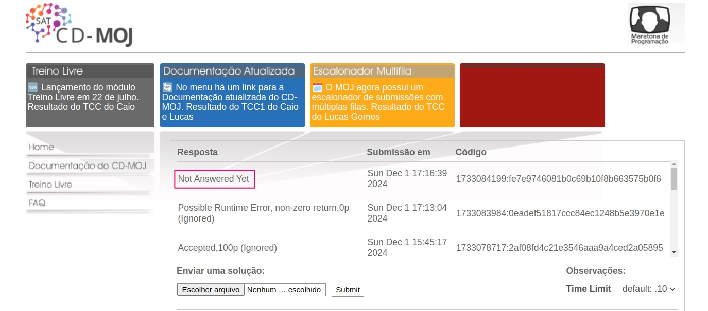
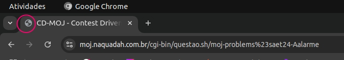
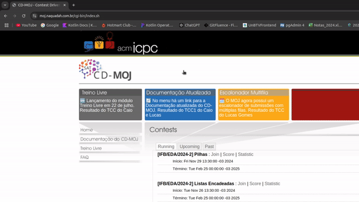
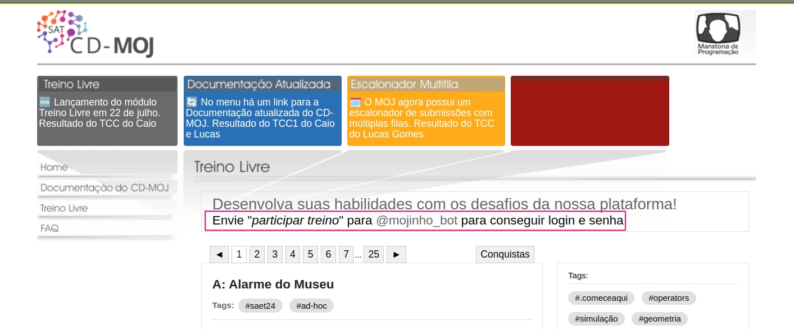

# Princípios gerais

## Introdução  

O design de sistemas interativos deve assegurar que as interfaces atendam às necessidades e expectativas dos usuários, promovendo uma interação eficiente, intuitiva e agradável. Seguir princípios gerais de design em IHC, como visibilidade, antecipação, simplicidade e consistência, não só melhora a experiência do utilizador, mas também contribui para a aceitação e eficácia do sistema. Este trabalho identifica violações desses princípios em um sistema de estudo de casos, propondo melhorias que podem ser aplicadas para alinhar o design às melhores práticas descritas no capítulo 8.2 do livro de Barbosa e Silva (2010)<a id="anchor_1" href="#REF1">^1^</a>.  

## Metodologia  

A análise foi conduzida por meio de inspeção heurística, com base nos princípios gerais de design descritos no Capítulo 8.2 do livro de Barbosa e Silva (2010)<a id="anchor_1" href="#REF1">^1^</a>. Inicialmente, foram avaliadas as interfaces do sistema, identificando problemas de usabilidade a partir da interação prática com suas funcionalidades. Os problemas encontrados foram documentados de forma detalhada, utilizando imagens e GIFs que ilustram as violações observadas.  

Posteriormente, foram desenvolvidas propostas de melhoria com foco em resolver as questões identificadas. Essa abordagem buscou garantir que as soluções propostas fossem aplicáveis, eficazes e sustentadas por práticas consagradas no campo da Interação Humano-Computador.  

## Promoção da Eficiência do Usuário

**Definição**  
Promover a eficiência do usuário significa priorizar sua economia de tempo e esforço, garantindo que ele possa continuar suas tarefas sem esperar por respostas do sistema. O sistema deve ser responsivo e evitar interromper ou dificultar o fluxo de trabalho do quem o utiliza.

**Violação**  
Como mostra a Figura 1, ao enviar a resposta de um problema, o sistema exibe o status "Not answered yet" como resposta inicial, e o status só é atualizado para outra mensagem relevante após o recarregar manualmente a página. Isso exige uma ação extra de quem faz uso da plataforma, quebrando o fluxo de interação e criando frustração, além de reduzir a eficiência.

**Figura 1:** Imagem da violação: Eficiência do usuário.

Fonte: [CD-MOJ](https://moj.naquadah.com.br/cgi-bin/index.sh), 2024.

**Sugestão de Melhoria**  

   - Implementar uma funcionalidade que atualize o status da resposta automaticamente assim que o sistema processar a submissão. 

   - Mostrar uma mensagem clara enquanto o sistema processa a resposta, como "Processando sua resposta..." ou similar, até que o status final seja recebido.

   - Garantir que não seja necessário recarregar a página para obter o status atualizado. Isso melhora a eficiência e a satisfação do usuário.

## Projeto para Erros

**Definição**  
O princípio de projeto para erros visa prevenir que os usuários cometam erros, além de oferecer mecanismos para recuperação caso os erros ocorram. Isso inclui tornar os sistemas exploráveis, facilitar a reversão de operações e evitar ações irreversíveis.

**Violação**  
Assim como exemplifica o GIF 1, quando o usuário faz o upload de um arquivo e, em seguida, troca de questão sem enviar, o arquivo é perdido. O sistema não alerta seus utilizadores sobre a possível perda de dados nem oferece uma maneira de recuperar o envio anterior. Isso aumenta a frustração e o risco de perda de progresso.

**GIF 1:** GIF da violação: Projeto para Erros.

Fonte: [CD-MOJ](https://moj.naquadah.com.br/cgi-bin/index.sh), 2024.

**Sugestão de Melhoria**  
   - Implementar um aviso ao usuário antes de trocar de questão, como:  
     - "Você possui alterações não salvas. Tem certeza de que deseja sair desta questão? Suas alterações serão perdidas."  
     - Oferecer botões de ação como "Cancelar" e "Continuar".

   - Adicionar funcionalidade para salvar automaticamente o arquivo enviado em um estado de rascunho vinculado à questão correspondente. Isso permite que o usuário recupere o upload ao retornar à questão.

   - Exibir claramente o status de uploads pendentes ou incompletos, com mensagens como "Envio pendente. Por favor, finalize antes de continuar."

## Visibilidade e Reconhecimento

**Definição**  
O princípio de visibilidade e reconhecimento enfatiza a importância de tornar as informações e elementos do sistema claramente perceptíveis para os usuários. Isso inclui elementos visuais que ajudam a identificar e diferenciar o sistema de outros, facilitando a navegação e o reconhecimento.

**Violação**  
Na figura 2 é possível ver que o site não possui um ícone personalizado (favicon) para identificá-lo nas abas do navegador, exibindo o ícone padrão ou nenhum ícone. Isso dificulta o reconhecimento do site entre várias abas abertas e prejudica a identidade visual da interface.

**Figura 2:** Imagem da violação: Visibilidade e Reconhecimento.

Fonte: [CD-MOJ](https://moj.naquadah.com.br/cgi-bin/index.sh), 2024.

**Sugestão de Melhoria**  
   
   - Desenvolver um favicon representativo do site, usando elementos visuais que remetam ao conteúdo ou marca do sistema.  

   - Certificar-se de que o favicon esteja alinhado ao branding do site, utilizando as mesmas cores ou logotipo para reforçar a identidade visual.

## Consistência e Padronização

**Definição**  
Consistência e padronização asseguram que os elementos da interface funcionem de maneira previsível e alinhada às expectativas dos usuários. Isso inclui comportamentos consistentes, como o redirecionamento em uma mesma aba ao clicar em links ou botões e limites claros para áreas clicáveis.

**Violação**

O GIF 2 exemplifica os seguintes casos:

1. O clique na logo redireciona para a página inicial, mas abre uma nova aba, o que não é uma prática padrão e pode confundir ou frustrar o usuário. O comportamento esperado é que o redirecionamento ocorra na mesma aba.  
2. A área clicável da logo se estende indevidamente para o espaço em branco ao redor, violando as expectativas de precisão e causando cliques acidentais.

**GIF 2:** GIF da violação: Consistência e Padronização.

Fonte: [CD-MOJ](https://moj.naquadah.com.br/cgi-bin/index.sh), 2024.

**Sugestão de Melhoria**  
   - Ajustar o comportamento do clique para que o redirecionamento para a página inicial ocorra na mesma aba, exceto em casos onde abrir em uma nova aba seja intencional e comunicado ao usuário.

   - Garantir que apenas a logo visível seja clicável.

## Simplicidade nas Estruturas das Tarefas

### Definição

Simplicidade nas estruturas das tarefas visa reduzir a complexidade e o esforço exigidos do usuário para realizar ações, promovendo fluxos diretos e intuitivos.

### Violação

O fluxo para acessar o módulo "Treino Livre" exige que o usuário entre em contato com um bot no Telegram, envie um comando específico e receba usuário e senha. Esse processo é complexo, dependente de uma ferramenta externa e pode confundir os usuários menos experientes.

**Figura 3:** Imagem da violação: Simplicidade nas Estruturas das Tarefas.

Fonte: [CD-MOJ](https://moj.naquadah.com.br/cgi-bin/index.sh), 2024.

### Sugestão de Melhoria

 - Permitir o login diretamente no site, eliminando a necessidade de interação com o bot do Telegram.
 - Se a integração com o bot for mantida, incorporar a funcionalidade ao site, permitindo que os comandos sejam executados dentro da própria interface.
 - Simplificar a comunicação e orientar o usuário claramente sobre os passos necessários para o login, reduzindo a dependência de ferramentas externas.

## Referências Bibliográficas  

<a id="REF1" href="#anchor_1">1.</a> BARBOSA, Simone Diniz Junqueira; SILVA, Bruno Santana da. *Interação Humano-Computador*. Rio de Janeiro: Elsevier, 2010.  

## Bibliografia

BARBOSA, Simone Diniz Junqueira; SILVA, Bruno Santana da. *Interação Humano-Computador*. Rio de Janeiro: Elsevier, 2010.  

VENTOY. Interação Humano Computador. Distrito Federal, 2023. Disponível em: [https://github.com/Interacao-Humano-Computador/2023.2-Ventoy](https://github.com/Interacao-Humano-Computador/2023.2-Ventoy). Acesso em: 29/11/2024.

BILHETERIA DIGITAL. Interação Humano Computador. Distrito Federal, 2023. Disponível em: [https://github.com/Interacao-Humano-Computador/2023.1-BilheteriaDigital](https://github.com/Interacao-Humano-Computador/2023.2-Ventoy). Acesso em: 30/11/2024.

## Histórico de Versões

**Tabela 1** - Histórico de versões.

| Versão |               Descrição                |   Autor    |    Data    |    Revisor     | Data de revisão |
| :----: | :------------------------------------: | :--------: | :--------: | :------------: | :-------------: |
|  1.0   | Documentação dos Princípios Gerais do Projeto. | [Felipe Rodrigues](https://github.com/felipeJRdev) e [João Vitor](https://github.com/Jauzimm) | 01/12/2024 | [Ruan Carvalho](https://github.com/Ruan-Carvalho) | 01/12/2024 |
