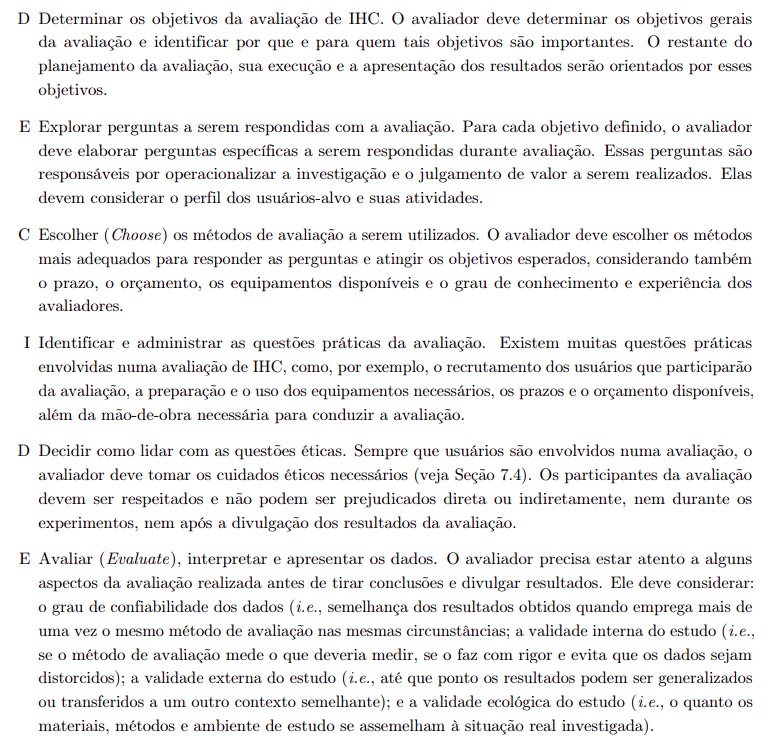

# Planejamento da Avaliação do Protótipo de Alta Fidelidade

## Introdução

A avaliação de protótipos desempenha um papel crucial no design centrado no usuário, ao enfatizar a identificação de problemas de usabilidade e a validação de soluções antes de prosseguir para etapas mais avançadas. Este documento apresenta o planejamento da avaliação de protótipos de alta fidelidade, um método eficaz e detalhado para testar soluções próximas ao produto final e coletar feedback dos usuários, utilizando o framework DECIDE para estruturar o processo e garantir resultados aplicáveis ao aprimoramento do protótipo.

## Objetivo

O objetivo desta avaliação é validar a usabilidade e a eficácia do protótipo de alta fidelidade desenvolvido, identificando problemas na interface e na interação com o usuário. O foco é coletar impressões sobre a clareza, funcionalidade e estética do protótipo.

## Metodologia

Será utilizado o framework DECIDE para o planejamento dessa avaliação, estruturando o processo em seis etapas a serem seguidas.

**Figura 1** - Framework DECIDE.

Autor(es): [João Vitor](https://github.com/Jauzimm), 2025.

## D - Determinar os objetivos

Determinar os objetivos de IHC é essencial para criar interfaces eficientes, acessíveis e alinhadas às necessidades dos usuários. Nesta avaliação, o foco será no protótipo de alta fidelidade, uma ferramenta de prototipagem avançada que permite testar aspectos como navegação, funcionalidade e estética. O principal ponto a ser abordado:

- **Problemas na interação e na interface**: Identificar e corrigir barreiras que dificultam o uso, contribuindo para uma experiência mais intuitiva e eficiente.

## E - Explorar as perguntas

Explorar as perguntas a serem respondidas é fundamental para orientar a avaliação de IHC, pois essas questões fornecem diretrizes claras para compreender o impacto do protótipo na experiência do usuário. 
Elas são cruciais para identificar elementos que funcionam bem, aqueles que necessitam de ajustes e para assegurar que o design esteja alinhado com as necessidades do público-alvo. 
O uso do protótipo de alta fidelidade facilita a análise ao permitir testes detalhados e realistas, garantindo feedback aprofundado e promovendo iterações precisas e efetivas no design.

**Tabela 1**: Perguntas do ponto escolhido.

| **Objetivo** | **Pergunta Avaliativa** | **Respostas** |
|:------------:|-------------------------|---------------|
| **Identificar problemas na interação e interface** | O usuário consegue operar o sistema? |  |
| | Ele atinge seu objetivo? Com quanta eficiência? Em quanto tempo? Após cometer quantos erros? |  |
| | Que parte da interface e da interação o deixa insatisfeito? |  |
| | Ele vai entender o que deve fazer em seguida? |  |

Autor(es): [João Vitor](https://github.com/Jauzimm), 2025.

## C - Escolher (Choose)

Para avaliar os protótipos, será utilizado o método de observação, que coleta dados sobre as atividades dos usuários, com ou sem sistemas interativos. Esse método permite identificar problemas reais durante a interação com o sistema, podendo ser realizado em contexto ou em laboratório. A observação em contexto oferece dados mais ricos sobre as ações dos usuários em seu ambiente real, enquanto a observação em laboratório é mais controlada e simples. Esses métodos ajudam a entender as percepções, preferências e dificuldades dos usuários, identificando problemas no design e na interação.

## I - Identificar e Administrar as Questões Práticas da Avaliação

### Recrutamento

Para o recrutamento, serão selecionadas cinco pessoas, uma para cada protótipo de alta fidelidade desenvolvido pelos integrantes do grupo. O público-alvo será definido com base no perfil de usuário identificado durante a análise de requisitos. As entrevistas serão conduzidas de forma presencial, garantindo a realização adequada das atividades planejadas.

### Preparação

Os entrevistadores conduzirão um teste piloto para garantir que as dinâmicas e os materiais estejam alinhados com os objetivos da avaliação. No contexto do protótipo de alta fidelidade, o processo consiste em apresentar ao usuário as opções disponíveis, orientando-o durante a navegação. Caso surjam dúvidas, os entrevistadores fornecerão explicações detalhadas sobre os passos a serem seguidos. A dinâmica permite observar a interação do usuário, o que nos ajudará a tomar decisões com base nos resultados da navegação e na forma como ele responde às orientações.

### Custos

Os recursos necessários serão mínimos, incluindo apenas dispositivos com acesso à internet para a gravação das entrevistas, além de ferramentas para captura de áudio e vídeo, a fim de registrar todos os detalhes. Os custos adicionais envolverão deslocamento até o local da entrevista, impressão de materiais de apoio, como roteiros e questionários, e equipamentos extras, conforme necessário.

### Prazos

Cada entrevistador conduzirá uma sessão com duração de até 10 minutos. O cronograma será ajustado conforme a disponibilidade dos participantes, com todas as sessões previstas para ocorrerem no intervalo entre os dias 16 e 24 de janeiro de 2025.

**Tabela 2**: Cronograma da Entrevista.

| Entrevistador(es)                       | Entrevistado(s)           | Horário de Início | Horário de Fim | Data       | Local                                      |
|:--------------------------------------:|:-------------------------:|:----------------:|:--------------:|:----------:|:------------------------------------------:|
| [Felipe Rodrigues](https://github.com/felipeJRdev)  | A definir                | A definir       | A definir     | 16/01/2025 - 24/01/2025 | Universidade de Brasília Campus Gama       |
| [Jéssica Eveline](https://github.com/xzxjesse)      | A definir                | A definir       | A definir     | 16/01/2025 - 24/01/2025 | Universidade de Brasília Campus Gama       |
| [João Vitor](https://github.com/Jauzimm)            | A definir                | A definir       | A definir     | 16/01/2025 - 24/01/2025 | Universidade de Brasília Campus Gama       |
| [Ruan Carvalho](https://github.com/Ruan-Carvalho)   | A definir                | A definir       | A definir     | 16/01/2025 - 24/01/2025 | Universidade de Brasília Campus Gama       |
| [Marcelo Adrian](https://github.com/Marcelo-Adrian) | A definir                | A definir       | A definir     | 16/01/2025 - 24/01/2025 | Universidade de Brasília Campus Gama       |

Autor(es): [João Vitor](https://github.com/Jauzimm), 2025.

## D - Decidir como lidar com as questões éticas

Os participantes serão informados sobre os objetivos da avaliação e o uso de suas respostas. Um [termo de consentimento](https://interacao-humano-computador.github.io/2024.2-Grupo05/entregas/entrega_2/aspectos_eticos/#termo-de-consentimento) será apresentado, garantindo o sigilo e a utilização ética das informações coletadas.

## E - Avaliar (Evaluate)

Após a coleta de dados, as respostas serão analisadas para identificar padrões e discrepâncias. O avaliador considerará a confiabilidade dos dados, a validade interna, externa e ecológica do estudo, garantindo que os resultados sejam consistentes, precisos e aplicáveis a contextos semelhantes. Os problemas identificados serão classificados por gravidade, e as sugestões dos participantes serão priorizadas para a implementação de melhorias no CD-MOJ.

## Planejamento do teste piloto

Antes de realizar a avaliação completa, é fundamental conduzir um teste piloto. Esse teste tem como objetivo validar o planejamento da avaliação, garantindo que os objetivos estejam bem definidos e que todos os procedimentos sejam claros e funcionais. Ele permite identificar e corrigir possíveis falhas nos métodos, avaliar a eficácia do roteiro de entrevista e assegurar que os materiais e dinâmicas atendam às expectativas do processo de avaliação.

**Tabela 3**: Tabela do planejamento do teste piloto.

| Ordem | Data       | Horário de Início e Fim | Local                              | Entrevistadores | Entrevistado |
|:-----:|:----------:|:-----------------------:|:----------------------------------:|:---------------:|:------------:|
|   1   | A definir | A definir          | Universidade de Brasília Campus Gama | A definir | A definir |

Autor(es): [João Vitor](https://github.com/Jauzimm), 2025.

## Bibliografia

Barbosa, S. D. J.; Silva, B. S. da; Silveira, M. S.; Gasparini, I.; Darin, T.; Barbosa, G. D. J. (2021) Interação Humano-Computador e Experiência do usuário. Autopublicação.

## Histórico de Versão

| Versão |               Descrição                |   Autor    |    Data    |    Revisor     | Data de revisão |
| :----: | :------------------------------------: | :--------: | :--------: | :------------: | :-------------: |
|  1.0   | Criação do planejamento da avaliação | [João Vitor](https://github.com/Jauzimm) | 12/01/2025 |  |  |
