# Protótipos de Alta Fidelidade

## Introdução

O protótipo de alta fidelidade é uma representação detalhada do sistema proposto, simulando com precisão a aparência e funcionalidade do produto final. Diferente dos protótipos de baixa fidelidade, que focam em ideias iniciais, o protótipo de alta fidelidade permite avaliar navegabilidade, desempenho e interação do usuário. Essa abordagem visa proporcionar uma experiência próxima à real, facilitando a identificação de melhorias e garantindo alinhamento com os objetivos do projeto.

## Objetivo

Baseado no nível 3 do processo de Design, Avaliação e Desenvolvimento da [Engenharia de Usabilidade de Mayhew](https://interacao-humano-computador.github.io/2024.2-CDMOJ/entregas/entrega_1/design/), este documento apresenta os protótipos de alta fidelidade desenvolvidos para as funcionalidades selecionadas. A construção dos protótipos foca na simulação detalhada das interfaces e interações, permitindo avaliação de usabilidade, navegabilidade e aderência às necessidades dos usuários.

## Metodologia

O desenvolvimento seguiu um processo iterativo, iniciado pela criação de protótipos de baixa fidelidade.

## Protótipos de Alta Fidelidade

Os protótipos representam as principais funcionalidades do sistema, cada uma desenvolvida por um integrante do grupo. A tela inicial comum foi projetada para oferecer navegação clara e acessível.

**Figura 1 -** Tela inicial do sistema:

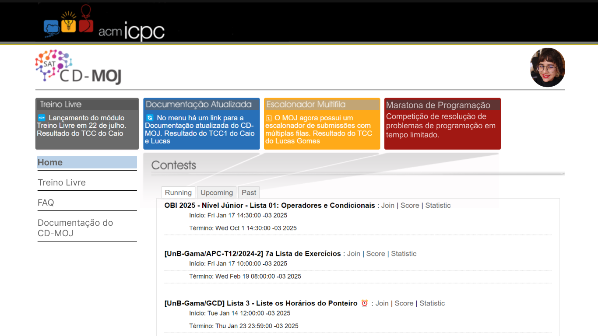

Autor(es):  [Jéssica Eveline](https://github.com/xzxjesse), 2025.

### Protótipo de Alta Fidelidade 1 - Realizar login no treino livre.

Após clicar em "Treino Livre" na tela inicial, o usuário é redirecionado para a tela abaixo.

**Figura 2 -** Tela do Treino Livre:

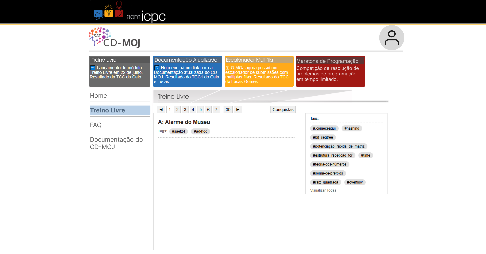

Autor(es): [Felipe Rodrigues](https://github.com/felipeJRdev) e [João Vitor](https://github.com/Jauzimm), 2025.

Nesta tela o usuário pode selecionar o questão que deseja resolver, neste caso, "A: Alarme do Museu". Após o selecioná-la será redirecionado para a seguinte página. 

**Figura 3 -** Tela Login do Treino Livre:

Autor(es): [Felipe Rodrigues](https://github.com/felipeJRdev) e [João Vitor](https://github.com/Jauzimm), 2025.

**Figura 4 -** Tela Login do Treino Livre:

Tela de erro de login caso clique em !Login" antes de registrar a conta.

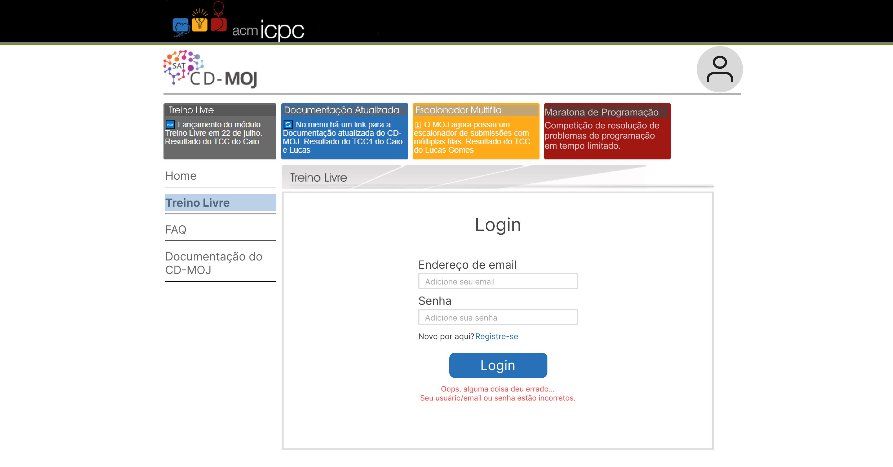

Autor(es): [Felipe Rodrigues](https://github.com/felipeJRdev) e [João Vitor](https://github.com/Jauzimm), 2025.

**Figura 5 -** Tela Cadastro do Treino Livre:

Após clicar em "Registre-se", será redirecionado para a tela de cadastro.

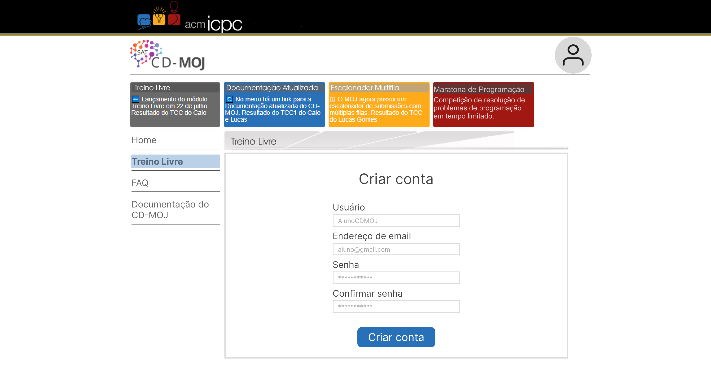

Autor(es): [Felipe Rodrigues](https://github.com/felipeJRdev) e [João Vitor](https://github.com/Jauzimm), 2025.

**Figura 6 -** Tela Validação de Email:

Após clicar em "Criar conta", será redirecionado para a tela de validação onde é possível clicar para reenviar o código ou "Confirmar".

Autor(es): [Felipe Rodrigues](https://github.com/felipeJRdev) e [João Vitor](https://github.com/Jauzimm), 2025.

**Figura 7 -** Tela Validação de Email reenviar código:

Se clicado para reenviar o código.

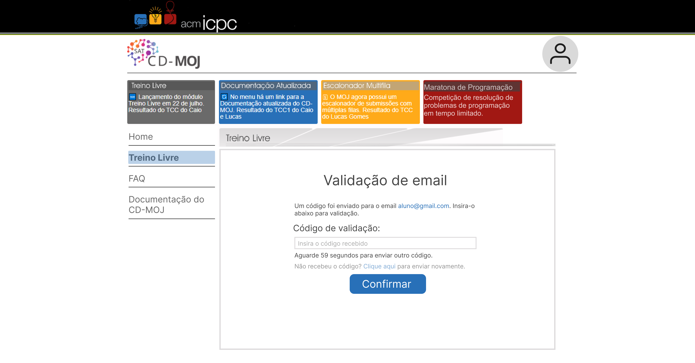

Autor(es): [Felipe Rodrigues](https://github.com/felipeJRdev) e [João Vitor](https://github.com/Jauzimm), 2025.

**Figura 8 -** Tela de Sucesso ao criar conta:

Se clicado em "Confirmar" será redirecionado à uma tela de confirmação de criação de conta.

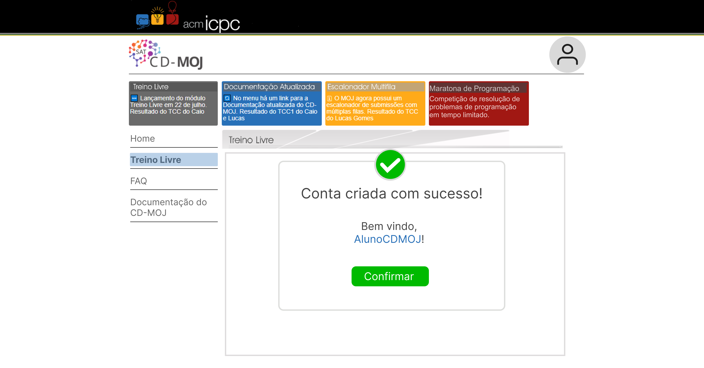

Autor(es): [Felipe Rodrigues](https://github.com/felipeJRdev) e [João Vitor](https://github.com/Jauzimm), 2025.

**Figura 9 -** Tela pós login:

Após a confirmação da criação de conta, há o redirecionamento para tela da questão de programação onde o usuário pode clicar em "Escolher arquivo".

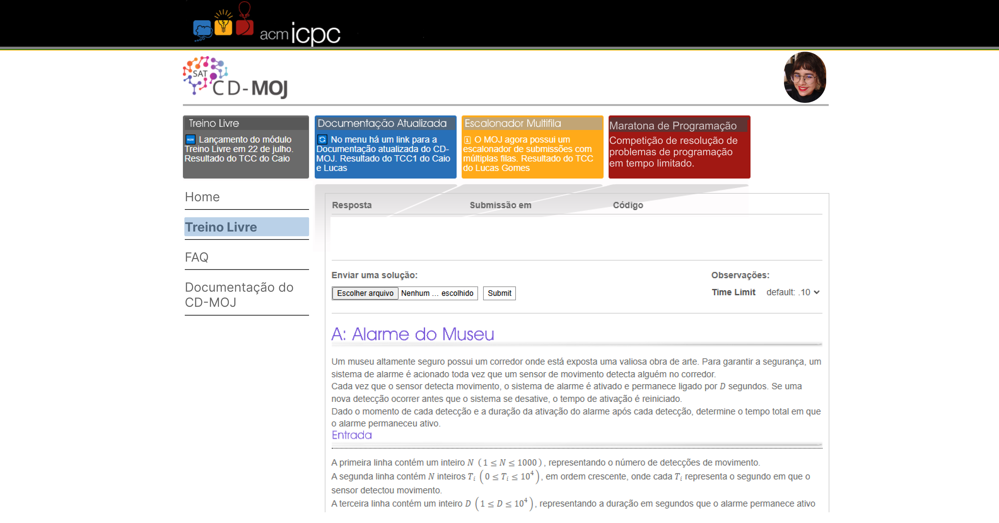

Autor(es): [Felipe Rodrigues](https://github.com/felipeJRdev) e [João Vitor](https://github.com/Jauzimm), 2025.

**Figura 10 -** Tela arquivo escolhido:

Após escolher o arquivo é possível clicar em "Submit" para receber o feedback.

Autor(es): [Felipe Rodrigues](https://github.com/felipeJRdev) e [João Vitor](https://github.com/Jauzimm), 2025.

**Figura 11-** Tela feedback de envio:

Após submeter o arquivo do código o usuário recebe o feedback em tempo real.

Autor(es): [Felipe Rodrigues](https://github.com/felipeJRdev) e [João Vitor](https://github.com/Jauzimm), 2025.

### Protótipo de Alta Fidelidade 2 - Alterar a senha

**Figura 12-** Tela barra lateral:

Ao clicar no ícone do perfil na tela inicial, abrirá uma barra lateral com algumas opções.

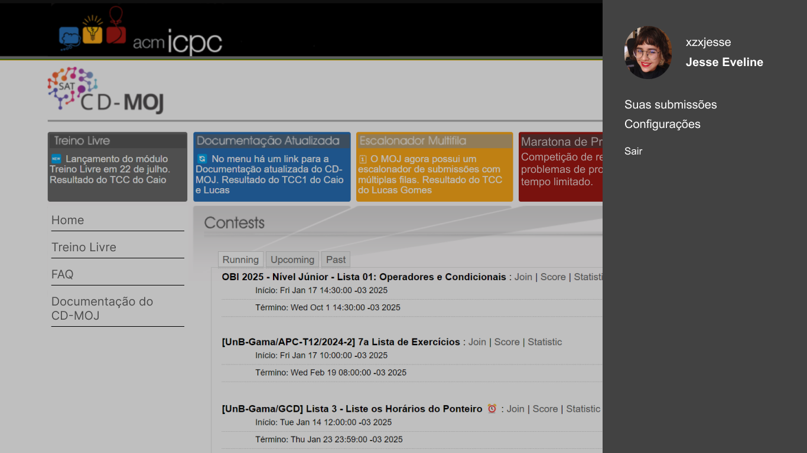

Autor(es): [Jéssica Eveline](https://github.com/xzxjesse), 2025.

**Figura 13 -** Tela Configurações:

Ao clicar no botão "Configurações" será redirecionado para a próxima tela.

Autor(es): [Jéssica Eveline](https://github.com/xzxjesse), 2025.

**Figura 14 -** Tela alterar senha:

Ao clicar no botão alterar senha, abrirá uma nova sessão abaixo para criação da senha.

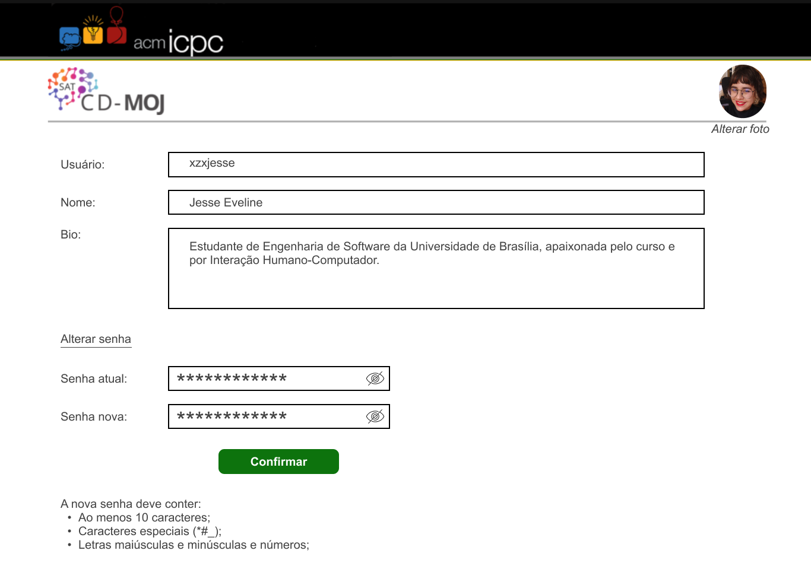

Autor(es): [Jéssica Eveline](https://github.com/xzxjesse), 2025.

**Figura 15 -** Tela confirmação de nova senha:

Ao clicar no botão "Confirmar", um pop up de confirmação será exibido.

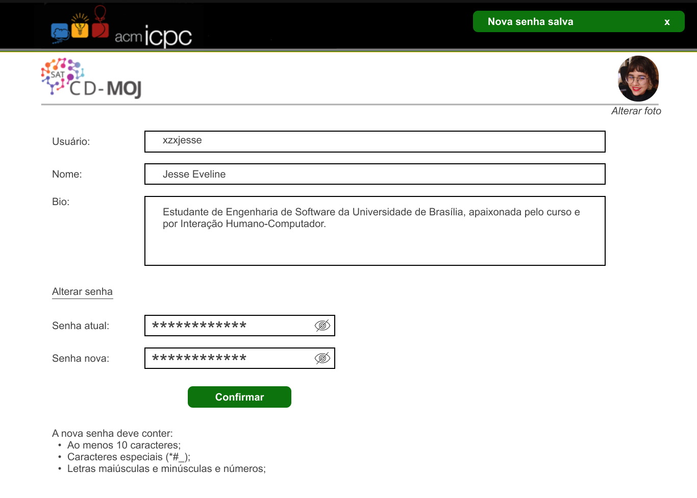

Autor(es): [Jéssica Eveline](https://github.com/xzxjesse), 2025.

**Figura 16 -** Tela senha incorreta:

Ao clicar no botão "Confirmar", porém com senha errada, um pop up de erro será exibido.

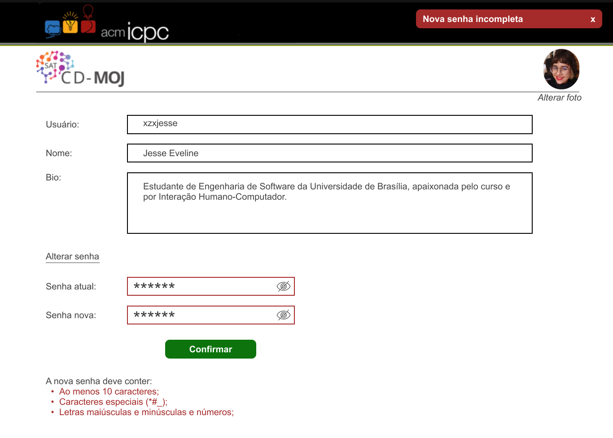

Autor(es): [Jéssica Eveline](https://github.com/xzxjesse), 2025.

### Protótipo de Alta Fidelidade 3 - Resultados dos Testes

**Figura 17 -** Tela submissão em contest:

Ao clicar em algum contest running na tela inicial, será redirecionado para a seguinte tela.

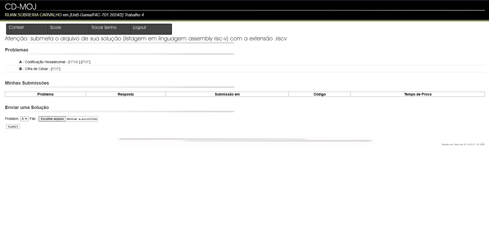

Autor(es): [Ruan Carvalho](https://github.com/Ruan-Carvalho) 2025.

**Figura 18 -** Tela arquivo escolhido:

Ao clicar em "Escolher Arquivo" e escolher um arquivo para submissão, será redirecionado para esta tela.

Autor(es): [Ruan Carvalho](https://github.com/Ruan-Carvalho) 2025.

**Figura 19 -** Tela após submissão:

Ao clicar em "Submit" será redirecionado para a seguinte tela.

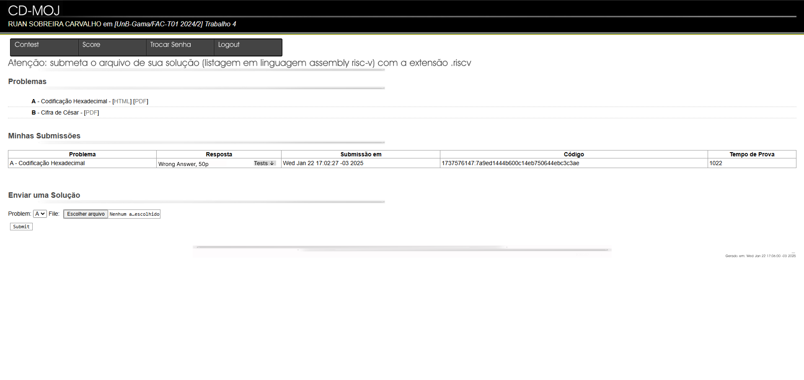

Autor(es): [Ruan Carvalho](https://github.com/Ruan-Carvalho) 2025.

**Figura 20 -** Visualizar resultados dos testes:

É possível visualizar os resultados dos testes clicando em "Tests".

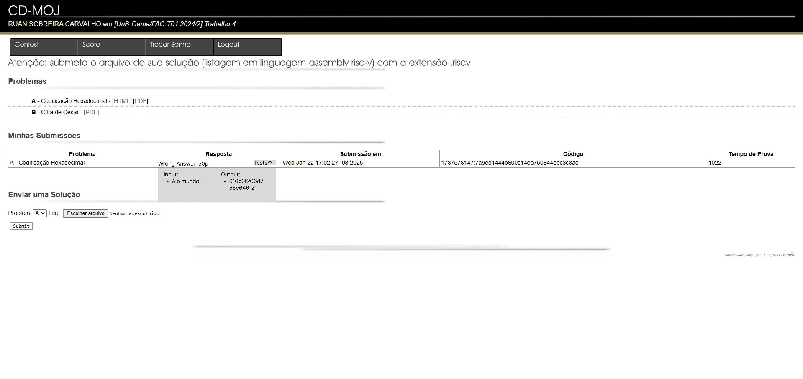

Autor(es): [Ruan Carvalho](https://github.com/Ruan-Carvalho) 2025.

## Bibliografia

BARBOSA, Simone Diniz Junqueira; DA SILVA, Bruno Santana. Planejamento da avaliação de IHC. In: INTERAÇÃO Humano-Computador. Rio de Janeiro: Elsevier Editora, 2010.

## Histórico de Versão

**Tabela 1** - Histórico de versões.

| Versão |               Descrição                |   Autor    |    Data    |    Revisor     | Data de revisão |
| :----: | :------------------------------------: | :--------: | :--------: | :------------: | :-------------: |
|  1.0   | Criação do documento | [Felipe Rodrigues](https://github.com/felipeJRdev) | 09/02/2025 | |  |

