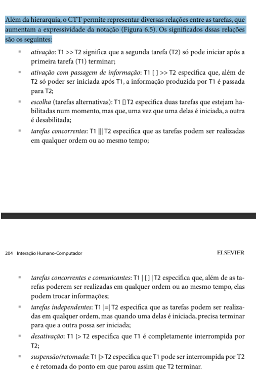
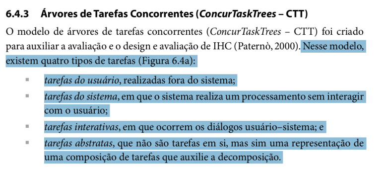
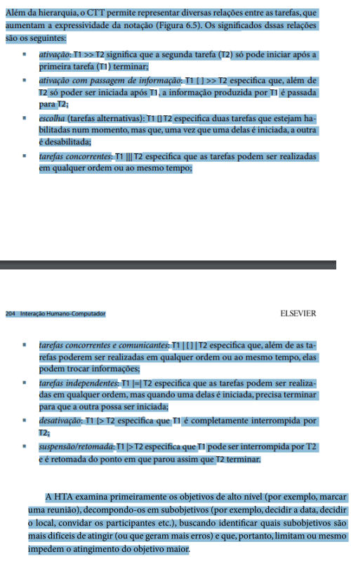
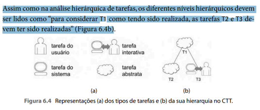

# Verificação Árvores de Tarefas Concorrentes (ConcurTaskTrees – CTT)

## Introdução

Este documento tem como objetivo apresentar a lista de verificação do artefato relacionado a Árvores de Tarefas Concorrentes (ConcurTaskTrees – CTT).

## Lista de Vertificação

A tabela abaixo apresenta a lista de verificação do artefato de Árvores de Tarefas Concorrentes (ConcurTaskTrees – CTT) do projeto. As respostas da lista podem ser: "Conforme", "Não Conforme", "Não Aplicável" e "Sugestão de Melhoria".

**Tabela 1** - Lista de Verificação - Árvores de Tarefas Concorrentes (ConcurTaskTrees – CTT).

| Item | Pergunta | Resposta | Versão, data e horário da avaliação | Referência |
|------|----------|----------|--------------------------------------|-------------|
| 1    | As relações entre tarefas no modelo CTT foram claramente representadas? |          | 1.0, 02/02/2025 às 23:20 |  SILVA, B. S.; BARBOSA, S. D. J. Interação Humano-Computador. 1. ed. Rio de Janeiro: Editora Campus, 2010. p. 203. Capítulo 6: Organização do Espaço de Problema. |
| 2    | O modelo CTT diferencia os tipos de tarefas de maneira clara e consistente? |          | 1.0, 02/02/2025 às 23:20 |  SILVA, B. S.; BARBOSA, S. D. J. Interação Humano-Computador. 1. ed. Rio de Janeiro: Editora Campus, 2010. p. 203. Capítulo 6: Organização do Espaço de Problema. |
| 3    | O modelo CTT inclui elementos que suportam o design de interação e a análise de tarefas? |          | 1.0, 02/02/2025 às 23:20 |  SILVA, B. S.; BARBOSA, S. D. J. Interação Humano-Computador. 1. ed. Rio de Janeiro: Editora Campus, 2010. p. 205. Capítulo 6: Organização do Espaço de Problema. |
| 4    | As 4 tarefas de CTT estão bem definidas e representadas? (Tarefas do usuário, tarefas do sistema, tarefas interativas e tarefas abstratas) |          | 1.0, 02/02/2025 às 23:20 |  BARBOSA, S. D. J.; SANTANA, B. Interação Humano-Computador. 1. ed. Rio de Janeiro: Elsevier, 2010. Capítulo 6, Item 6.4.3, p. 203. |
| 5    | O CTT utiliza corretamente as relações entre as tarefas? |          | 1.0, 02/02/2025 às 23:20 |  BARBOSA, S. D. J.; SANTANA, B. Interação Humano-Computador. 1. ed. Rio de Janeiro: Elsevier, 2010. Capítulo 6, Item 6.4.3, p. 203. |
| 6    | Os níveis hierárquicos do CTT estão bem representados? |          | 1.0, 02/02/2025 às 23:20 |  BARBOSA, S. D. J.; SANTANA, B. Interação Humano-Computador. 1. ed. Rio de Janeiro: Elsevier, 2010. Capítulo 6, Item 6.4.3, p. 203. |

Autor(es): [Felipe Rodrigues](https://github.com/felipeJRdev), [Jéssica Eveline](https://github.com/xzxjese), 2025.

## Referência Bibliográfica

BARBOSA, Simone Diniz Junqueira; SILVA, Bruno Santana da. *Interação Humano-Computador*. Rio de Janeiro: Elsevier, 2010.  

## Histórico de Versões

**Tabela 2** - Histórico de versões.

| Versão | Descrição | Autor(es) | Data | Revisor(es) | Data de revisão |
| :----: | :-------: | :-------: | :--: | :-------------------------------: | :-------------: |
|  1.0   | Criação do Documento | [Felipe Rodrigues](https://github.com/felipeJRdev) | 02/02/2025 | |   |