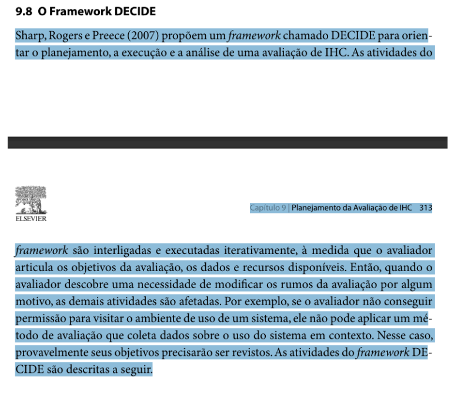
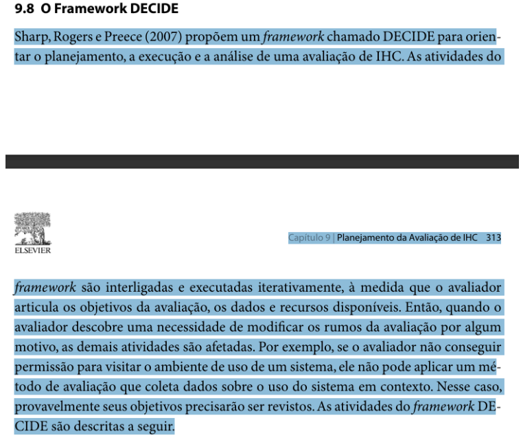
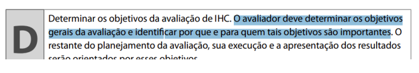
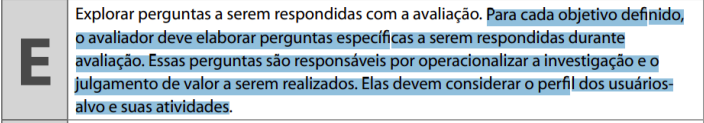
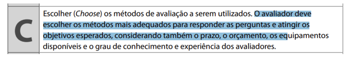

# Verificação Planejamento da Avaliação com o Framework DECIDE

## Introdução

Este documento tem como objetivo apresentar a lista de verificação do artefato relacionado a Planejamento da Avaliação com o Framework DECIDE.

## Lista de Vertificação

A tabela abaixo apresenta a lista de verificação do artefato de Planejamento da Avaliação com o Framework DECIDE do projeto. As respostas da lista podem ser: "Conforme", "Não Conforme", "Não Aplicável" e "Sugestão de Melhoria".

**Tabela 1** - Lista de Verificação - Planejamento da Avaliação com o Framework DECIDE.

| Item | Pergunta | Resposta | Versão, data e horário da avaliação | Referência |
|------|----------|----------|--------------------------------------|-------------|
| 1    | O planejamento da avaliação articula claramente os objetivos, dados e recursos disponíveis, considerando possíveis limitações e revisões iterativas no processo? |          | 1.0, 02/02/2025 às 23:20 |  SILVA, B. S.; BARBOSA, S. D. J. Interação Humano-Computador. 1. ed. Rio de Janeiro: Editora Campus, 2010. p. 313. Capítulo 09: Planejamento da Avaliação de IHC. |
| 2    | O relato identifica ajustes necessários no planejamento da avaliação, como a adaptação de métodos ou objetivos, em resposta a limitações como falta de acesso ao ambiente de uso? |          | 1.0, 02/02/2025 às 23:20 |  SILVA, B. S.; BARBOSA, S. D. J. Interação Humano-Computador. 1. ed. Rio de Janeiro: Editora Campus, 2010. p. 313. Capítulo 09: Planejamento da Avaliação de IHC. |
| 3    | O planejamento da avaliação define claramente os objetivos gerais e específicos, vinculando-os às perguntas que operacionalizam a investigação e consideram o perfil dos usuários e suas atividades? |          | 1.0, 02/02/2025 às 23:20 |  SILVA, B. S.; BARBOSA, S. D. J. Interação Humano-Computador. 1. ed. Rio de Janeiro: Editora Campus, 2010. p. 313. Capítulo 09: Planejamento da Avaliação de IHC. |
| 4    | Os objetivos gerais da avaliação e o porquê e para quem os objetivos são importantes estão descritos no planejamento? |          | 1.0, 02/02/2025 às 23:20 |  BARBOSA, S. D. J.; SANTANA, B. Interação Humano-Computador. 1. ed. Rio de Janeiro: Elsevier, 2010. Capítulo 9, Item 9.8, p. 313. |
| 5    | Para cada objetivo, são exploradas perguntas específicas que consideram o perfil dos usuários-alvo? |          | 1.0, 02/02/2025 às 23:20 |  BARBOSA, S. D. J.; SANTANA, B. Interação Humano-Computador. 1. ed. Rio de Janeiro: Elsevier, 2010. Capítulo 9, Item 9.8, p. 313. |
| 6    | Foram definidos os métodos para responder as perguntas e atingir os objetivos esperados, considerando prazo, orçamento, equipamentos e o grau de conhecimento e experiência dos avaliadores? |          | 1.0, 02/02/2025 às 23:20 |  BARBOSA, S. D. J.; SANTANA, B. Interação Humano-Computador. 1. ed. Rio de Janeiro: Elsevier, 2010. Capítulo 9, Item 9.8, p. 313. |

Autor(es): [Felipe Rodrigues](https://github.com/felipeJRdev), [Jéssica Eveline](https://github.com/xzxjese), 2025.

## Referência Bibliográfica

BARBOSA, Simone Diniz Junqueira; SILVA, Bruno Santana da. *Interação Humano-Computador*. Rio de Janeiro: Elsevier, 2010.  

## Histórico de Versões

**Tabela 2** - Histórico de versões.

| Versão | Descrição | Autor(es) | Data | Revisor(es) | Data de revisão |
| :----: | :-------: | :-------: | :--: | :-------------------------------: | :-------------: |
|  1.0   | Criação do Documento | [Felipe Rodrigues](https://github.com/felipeJRdev) | 02/02/2025 | |   |