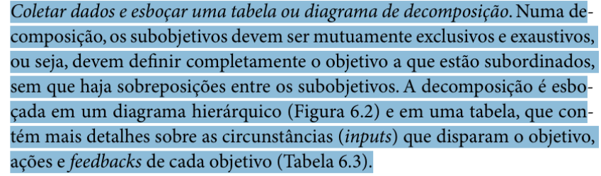

# Verificação Análise hierárquica de tarefas  (HTA – Hierarchical Task Analysis)

## Introdução

Este documento tem como objetivo apresentar a lista de verificação do artefato relacionado a Análise hierárquica de tarefas (HTA – Hierarchical Task Analysis).

## Lista de Vertificação

A tabela abaixo apresenta a lista de verificação do artefato de Análise hierárquica de tarefas (HTA – Hierarchical Task Analysis) do projeto. As respostas da lista podem ser: "Conforme", "Não Conforme", "Não Aplicável" e "Sugestão de Melhoria".

**Tabela 1** - Lista de Verificação - Análise hierárquica de tarefas (HTA – Hierarchical Task Analysis).

| Item | Pergunta | Resposta | Versão, data e horário da avaliação | Referência |
|------|----------|----------|--------------------------------------|-------------|
| 1    | Os objetivos de alto nível e os subobjetivos foram definidos de forma clara e hierárquica? |          | 1.0, 02/02/2025 às 23:20 |  SILVA, B. S.; BARBOSA, S. D. J. Interação Humano-Computador. 1. ed. Rio de Janeiro: Editora Campus, 2010. p. 193. Capítulo 6: Organização do Espaço de Problema. |
| 2    | Os planos foram documentados, definindo as relações entre os subobjetivos (sequência fixa, regra de seleção ou paralelismo)? |          | 1.0, 02/02/2025 às 23:20 |  SILVA, B. S.; BARBOSA, S. D. J. Interação Humano-Computador. 1. ed. Rio de Janeiro: Editora Campus, 2010. p. 193. Capítulo 6: Organização do Espaço de Problema. |
| 3    | A decomposição de tarefas foi realizada de forma mutuamente exclusiva e exaustiva, cobrindo completamente o objetivo principal? |          | 1.0, 02/02/2025 às 23:20 |  SILVA, B. S.; BARBOSA, S. D. J. Interação Humano-Computador. 1. ed. Rio de Janeiro: Editora Campus, 2010. p. 196. Capítulo 6: Organização do Espaço de Problema. |
| 4    | A análise hierárquica de tarefas (HTA) possui um objetivo definido no início? |          | 1.0, 02/02/2025 às 23:20 |  BARBOSA, S. D. J.; SANTANA, B. Interação Humano-Computador. 1. ed. Rio de Janeiro: Elsevier, 2010. Capítulo 6, Item 6.4.1, p. 192. |
| 5    | A HTA possui objetivos de alto nível e sub-objetivos? |          | 1.0, 02/02/2025 às 23:20 |  BARBOSA, S. D. J.; SANTANA, B. Interação Humano-Computador. 1. ed. Rio de Janeiro: Elsevier, 2010. Capítulo 6, Item 6.4.1, p. 193. |
| 6    | A HTA possui sub-objetivos bem relacionados e representados? Relação de sequência fixa; regra de seleção ou decisão; paralelo ou operação. |          | 1.0, 02/02/2025 às 23:20 |  BARBOSA, S. D. J.; SANTANA, B. Interação Humano-Computador. 1. ed. Rio de Janeiro: Elsevier, 2010. Capítulo 6, Item 6.4.1, p. 193. |

Autor(es): [Felipe Rodrigues](https://github.com/felipeJRdev), [Jéssica Eveline](https://github.com/xzxjese), 2025.

## Referência Bibliográfica

BARBOSA, Simone Diniz Junqueira; SILVA, Bruno Santana da. *Interação Humano-Computador*. Rio de Janeiro: Elsevier, 2010.  

## Histórico de Versões

**Tabela 2** - Histórico de versões.

| Versão | Descrição | Autor(es) | Data | Revisor(es) | Data de revisão |
| :----: | :-------: | :-------: | :--: | :-------------------------------: | :-------------: |
|  1.0   | Criação do Documento | [Felipe Rodrigues](https://github.com/felipeJRdev) | 02/02/2025 | |   |