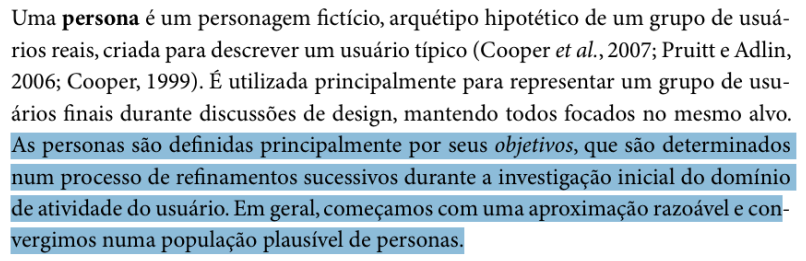
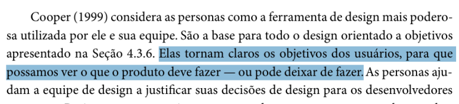
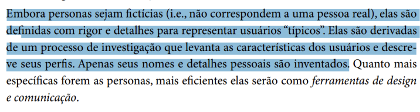
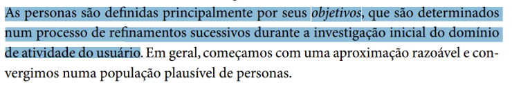

# Verificação Personas

## Introdução

Este documento tem como objetivo apresentar a lista de verificação do artefato relacionado a Personas.

## Lista de Vertificação

A tabela abaixo apresenta a lista de verificação do artefato de Personas do projeto. As respostas da lista podem ser: "Conforme", "Não Conforme", "Não Aplicável" e "Sugestão de Melhoria".

**Tabela 1** - Lista de Verificação - Personas.

| Item | Pergunta | Resposta | Versão, data e horário da avaliação | Referência |
|------|----------|----------|--------------------------------------|-------------|
| 1    | A persona deve ser baseada em dados reais e representativos dos usuários-alvo, incluindo suas necessidades, comportamentos e objetivos? |          | 1.0, 02/02/2025 às 23:20 |   SILVA, B. S.; BARBOSA, S. D. J. Interação Humano-Computador. 1. ed. Rio de Janeiro: Editora Campus, 2010. p. 176. Capítulo 6: Organização do Espaço de Problema. |
| 2    | A criação de personas ajuda a focar no design de soluções que atendam de forma eficaz as necessidades dos usuários? |          | 1.0, 02/02/2025 às 23:20 |  SILVA, B. S.; BARBOSA, S. D. J. Interação Humano-Computador. 1. ed. Rio de Janeiro: Editora Campus, 2010. p. 177. Capítulo 6: Organização do Espaço de Problema. |
| 3    | As personas são usadas para guiar decisões de design e priorizar funcionalidades, garantindo que o produto final seja relevante para os usuários? |          | 1.0, 02/02/2025 às 23:20 |   SILVA, B. S.; BARBOSA, S. D. J. Interação Humano-Computador. 1. ed. Rio de Janeiro: Editora Campus, 2010. p. 179. Capítulo 6: Organização do Espaço de Problema. |
| 4    | As personas possuem as seguintes características: Identidade, Status, Objetivos, Habilidades, Tarefas, Relacionamento, Requisitos e Expectativas? |          | 1.0, 02/02/2025 às 23:20 |  BARBOSA, S. D. J.; SANTANA, B. Interação Humano-Computador. 1. ed. Rio de Janeiro: Elsevier, 2010. Capítulo 6, p. 177. |
| 5    | As personas são definidas com rigor e detalhes, após um processo de investigação levantado para encontrar as características dos usuários e seus perfis? |          | 1.0, 02/02/2025 às 23:20 |  BARBOSA, S. D. J.; SANTANA, B. Interação Humano-Computador. 1. ed. Rio de Janeiro: Elsevier, 2010. Capítulo 6, p. 177. |
| 6    | As personas possuem objetivos claros definidos durante a investigação de atividade do usuário? |          | 1.0, 02/02/2025 às 23:20 |  BARBOSA, S. D. J.; SANTANA, B. Interação Humano-Computador. 1. ed. Rio de Janeiro: Elsevier, 2010. Capítulo 6, p. 176. |

Autor(es): [Felipe Rodrigues](https://github.com/felipeJRdev), [Jéssica Eveline](https://github.com/xzxjese), 2025.

## Referência Bibliográfica

BARBOSA, Simone Diniz Junqueira; SILVA, Bruno Santana da. *Interação Humano-Computador*. Rio de Janeiro: Elsevier, 2010.  

## Histórico de Versões

**Tabela 2** - Histórico de versões.

| Versão | Descrição | Autor(es) | Data | Revisor(es) | Data de revisão |
| :----: | :-------: | :-------: | :--: | :-------------------------------: | :-------------: |
|  1.0   | Criação do Documento | [Felipe Rodrigues](https://github.com/felipeJRdev) | 02/02/2025 | |   |