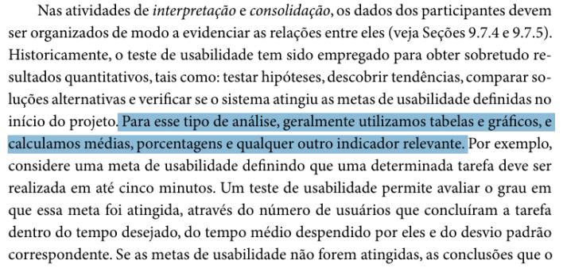
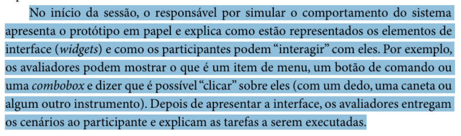
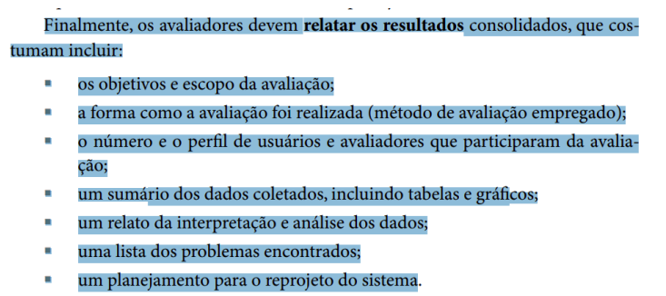

# Verificação  O Planejamento do Resultado e o Resultado da Avaliação

## Introdução

Este documento tem como objetivo apresentar a lista de verificação do artefato relacionado a  O Planejamento do Resultado e o Resultado da Avaliação.

## Lista de Vertificação

A tabela abaixo apresenta a lista de verificação do artefato de  O Planejamento do Resultado e o Resultado da Avaliação do projeto. As respostas da lista podem ser: "Conforme", "Não Conforme", "Não Aplicável" e "Sugestão de Melhoria".

**Tabela 1** - Lista de Verificação -  O Planejamento do Resultado e o Resultado da Avaliação.

| Item | Pergunta | Resposta | Versão, data e horário da avaliação | Referência |
|------|----------|----------|--------------------------------------|-------------|
| 1    | O resultado apresenta os dados obtidos durante as avaliações em formato de tabela para facilitar a análise? |          | 1.0, 02/02/2025 às 23:20 |  SILVA, B. S.; BARBOSA, S. D. J. Interação Humano-Computador. 1. ed. Rio de Janeiro: Editora Campus, 2010. p. 342. Capítulo 10: Métodos de Avaliação de IHC. |
| 2    | A avaliação se inicia com a descrição de como o protótipo foi apresentado aos participantes, incluindo a explicação sobre os elementos de interface e a forma de interação com eles? |          | 1.0, 02/02/2025 às 23:20 |  SILVA, B. S.; BARBOSA, S. D. J. Interação Humano-Computador. 1. ed. Rio de Janeiro: Editora Campus, 2010. p. 360. Capítulo 10: Métodos de Avaliação de IHC. |
| 3    | O resultado apresenta a análise das observações e entrevistas realizadas, incluindo a identificação de problemas de usabilidade e sugestões de melhorias para o protótipo? |          | 1.0, 02/02/2025 às 23:20 |  SILVA, B. S.; BARBOSA, S. D. J. Interação Humano-Computador. 1. ed. Rio de Janeiro: Editora Campus, 2010. p. 361. Capítulo 10: Métodos de Avaliação de IHC. |
| 4    | Na consolidação de resultados, os avaliadores endereçam novamente as questões que motivaram o estudo, buscando respondê-las ou justificar por que alguma resposta não foi encontrada? |          | 1.0, 02/02/2025 às 23:20 |  BARBOSA, S. D. J.; SANTANA, B. Interação Humano-Computador. 1. ed. Rio de Janeiro: Elsevier, 2010. Capítulo 9, Item 9.7.5, p. 311. |
| 5    | O relato dos resultados possui os seguintes itens: - Os objetivos e escopo da avaliação; - A forma como a avaliação foi realizada (método de avaliação empregado); - O número e o perfil de usuários e avaliadores que participaram da avaliação; - Um sumário dos dados coletados, incluindo tabelas e gráficos; - Uma interpretação e análise dos dados; - Uma lista dos problemas encontrados e - Um planejamento para o reprojeto do sistema? |          | 1.0, 02/02/2025 às 23:20 |  BARBOSA, S. D. J.; SANTANA, B. Interação Humano-Computador. 1. ed. Rio de Janeiro: Elsevier, 2010. Capítulo 9, Item 9.7.5, p. 311. |

Autor(es): [Felipe Rodrigues](https://github.com/felipeJRdev), [Jéssica Eveline](https://github.com/xzxjese), 2025.

## Referência Bibliográfica

BARBOSA, Simone Diniz Junqueira; SILVA, Bruno Santana da. *Interação Humano-Computador*. Rio de Janeiro: Elsevier, 2010.  

## Histórico de Versões

**Tabela 2** - Histórico de versões.

| Versão | Descrição | Autor(es) | Data | Revisor(es) | Data de revisão |
| :----: | :-------: | :-------: | :--: | :-------------------------------: | :-------------: |
|  1.0   | Criação do Documento | [Felipe Rodrigues](https://github.com/felipeJRdev) | 02/02/2025 | |   |