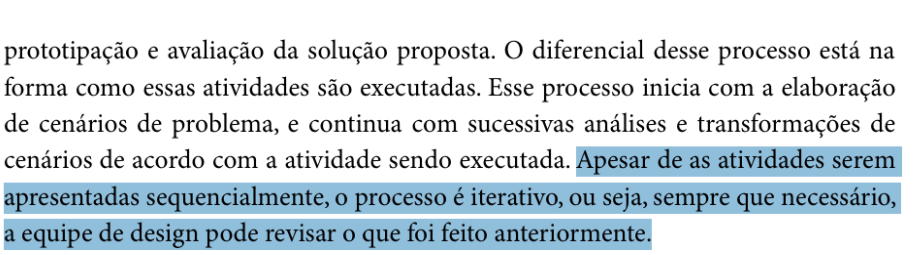
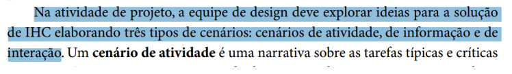
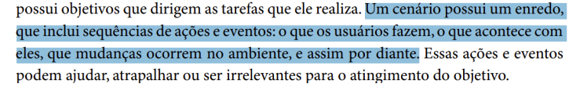
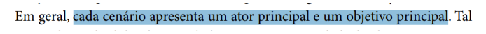
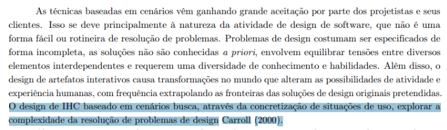
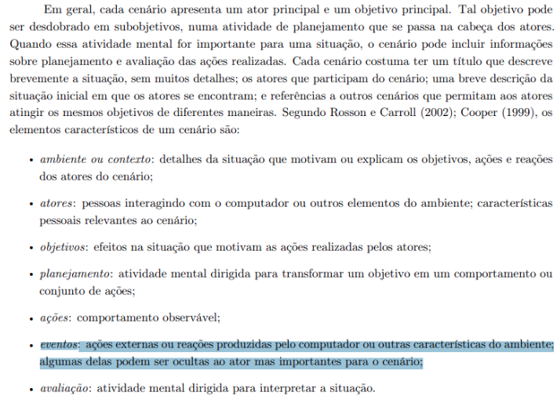
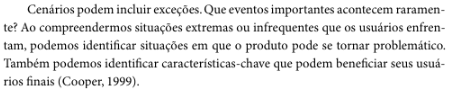
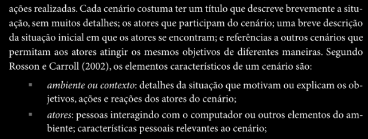

# Verificação Cenários

## Introdução

Este documento tem como objetivo apresentar a lista de verificação do artefato relacionado a Cenários.

## Lista de Vertificação

A tabela abaixo apresenta a lista de verificação do artefato de Cenários do projeto. As respostas da lista podem ser: "Conforme", "Não Conforme", "Não Aplicável" e "Sugestão de Melhoria".

**Tabela 1** - Lista de Verificação - Cenários.

| Item | Pergunta | Resposta | Versão, data e horário da avaliação | Referência |
|------|----------|----------|--------------------------------------|-------------|
| 1    | A equipe de design está considerando características dos usuários, suas atividades típicas e críticas, os artefatos utilizados e o contexto de uso na formulação dos cenários de problema? | Conforme | 1.0, 03/02/2025 às 22:20 |  SILVA, B. S.; BARBOSA, S. D. J. Interação Humano-Computador. 1. ed. Rio de Janeiro: Editora Campus, 2010. p. 113. Capítulo 4: Processos de Design de IHC. |
| 2    | As narrativas dos cenários de atividade incluem as tarefas típicas e críticas dos usuários, sem detalhar como eles interagirão com o sistema ou sua aparência? | Conforme | 1.0, 03/02/2025 às 22:20 |  SILVA, B. S.; BARBOSA, S. D. J. Interação Humano-Computador. 1. ed. Rio de Janeiro: Editora Campus, 2010. p. 113. Capítulo 4: Processos de Design de IHC. |
| 3    | O processo de design está sendo iterativo, permitindo revisões nas atividades previamente executadas quando necessário? | Conforme         | 1.0, 03/02/2025 às 22:34 |  SILVA, B. S.; BARBOSA, S. D. J. Interação Humano-Computador. 1. ed. Rio de Janeiro: Editora Campus, 2010. p. 113. Capítulo 4: Processos de Design de IHC. |
| 4    | O projeto possui três tipos de cenários: cenários de atividade, de informação e de interação? |  Não conforme        | 1.0, 03/02/2025 às 22:35 |  BARBOSA, S. D. J.; SANTANA, B. Interação Humano-Computador. 1. ed. Rio de Janeiro: Elsevier, 2010. Capítulo 4, Item 4.3.5, p. 113. |
| 5    | Os cenários possuem um enredo que inclui sequências de eventos: o que os usuários fazem, o que acontece com eles, que mudanças ocorrem no ambiente, e assim por diante? | conforme | 1.0, 03/02/2025 às 22:34 |  BARBOSA, S. D. J.; SANTANA, B. Interação Humano-Computador. 1. ed. Rio de Janeiro: Elsevier, 2010. Capítulo 6, Item 6.3, p. 183. |
| 6    | Os cenários possuem um ator principal e um objetivo principal? | Conforme         | 1.0, 03/02/2025 às 22:19 |  BARBOSA, S. D. J.; SANTANA, B. Interação Humano-Computador. 1. ed. Rio de Janeiro: Elsevier, 2010. Capítulo 6, Item 6.3, p. 183. |
| 7    | Foi identificado quais aspectos do sistema poderiam ser problemáticos para os atores durante a realização de suas tarefas, e como isso poderia impactar o sucesso ou a falha de suas ações? | Conforme  | 1.0, 03/02/2025 às 22:18 |  Página 159, Capítulo 8. Organização do Espaço de Problema. Barbosa, S. D. J.; Silva, B. S. da; Silveira, M. S.; Gasparini, I.; Darin, T.; Barbosa, G. D. J. (2021) Interação Humano-Computador e Experiência do usuário. Autopublicação. |
| 8    | Foi utilizado os cenários como uma forma de explorar a complexidade do design do sistema, ajudando a entender como diferentes elementos interagem e impactam a experiência do usuário? | Conforme | 1.0, 03/02/2025 às 22:19  |  Página 159, Capítulo 8. Organização do Espaço de Problema. Barbosa, S. D. J.; Silva, B. S. da; Silveira, M. S.; Gasparini, I.; Darin, T.; Barbosa, G. D. J. (2021) Interação Humano-Computador e Experiência do usuário. Autopublicação. |
| 9    | Ao criar o cenário, foi tomado o devido cuidado para incluir as interações externas que poderiam impactar a situação, como ações do sistema ou de outros atores, que não são imediatamente visíveis para o usuário, mas influenciam diretamente sua experiência? | Conforme | 1.0, 03/02/2025 às 22:30  |  Página 159, Capítulo 8. Organização do Espaço de Problema. Barbosa, S. D. J.; Silva, B. S. da; Silveira, M. S.; Gasparini, I.; Darin, T.; Barbosa, G. D. J. (2021) Interação Humano-Computador e Experiência do usuário. Autopublicação. |
| 10   | O cenário apresenta todos os elementos fundamentais de sua construção (título, ambiente, atores e objetivos)? | Conforme | 1.0, 03/02/2025 às 22:24  |  BARBOSA, Simone Diniz Junqueira; SILVA, Bruno Santana da. Interação Humano-Computador. Rio de Janeiro: Elsevier, 2010. p. 183. |
| 11   | O cenário ajuda a identificação de requisitos e exploração de opções de design? | Conforme | 1.0, 03/02/2025 às 22:25  |  BARBOSA, Simone Diniz Junqueira; SILVA, Bruno Santana da. Interação Humano-Computador. Rio de Janeiro: Elsevier, 2010. p. 183. |
| 12   | O cenário considera situações raras ou extremas que podem impactar os usuários? | conforme | 1.0, 03/02/2025 às 22:20 |  BARBOSA, Simone Diniz Junqueira; SILVA, Bruno Santana da. Interação Humano-Computador. Rio de Janeiro: Elsevier, 2010. p. 185. |
| 13   | O cenário inclui um ambiente ou contexto que detalha a situação e motiva os objetivos e ações dos atores? | Conforme | 1.0, 03/02/2025 às 22:23  |  BARBOSA, Simone Diniz Junqueira; SILVA, Bruno Santana da. Interação Humano-Computador. Rio de Janeiro: Elsevier, 2010. p. 184. |

Autor(es): [Felipe Rodrigues](https://github.com/felipeJRdev), [Jéssica Eveline](https://github.com/xzxjese), [Ruan Carvalho](https://github.com/Ruan-Carvalho), [João Vitor Santos](https://github.com/Jauzimm) e [Marcelo Adrian](https://github.com/Marcelo-Adrian) 2025.

## Referência Bibliográfica

> BARBOSA, Simone Diniz Junqueira; SILVA, Bruno Santana da. *Interação Humano-Computador*. Rio de Janeiro: Elsevier, 2010.  
> Barbosa, S. D. J.; Silva, B. S. da; Silveira, M. S.; Gasparini, I.; Darin, T.; Barbosa, G. D. J. (2021) Interação Humano-Computador e Experiência do usuário.

## Histórico de Versões

**Tabela 2** - Histórico de versões.

| Versão | Descrição | Autor(es) | Data | Revisor(es) | Data de revisão |
| :----: | :-------: | :-------: | :--: | :-------------------------------: | :-------------: |
|  1.0   | Criação do Documento | [Felipe Rodrigues](https://github.com/felipeJRdev) | 02/02/2025 | [Ruan Carvalho](https://github.com/Ruan-Carvalho), [João Vitor Santos](https://github.com/Jauzimm) e [Marcelo Adrian](https://github.com/Marcelo-Adrian) | 03/02/2025 |