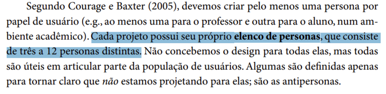
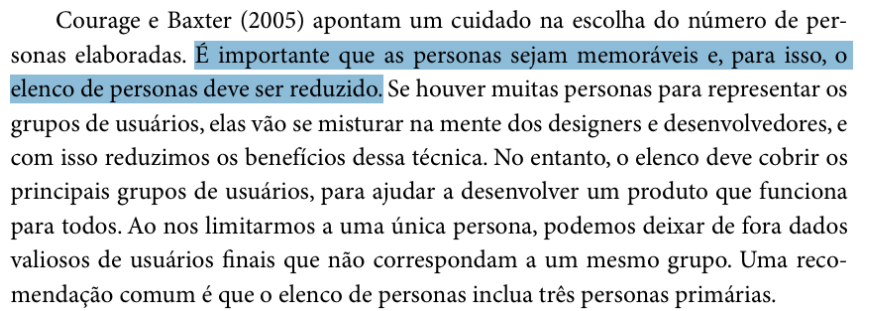
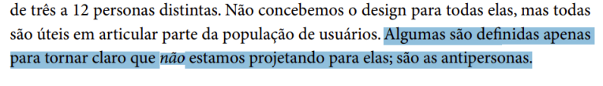
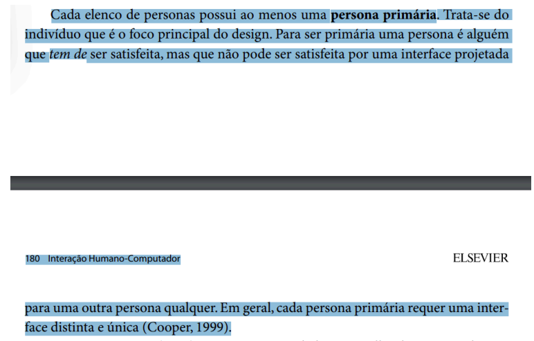
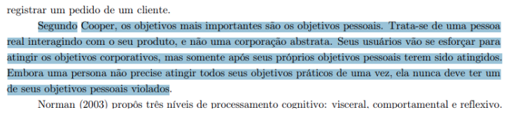
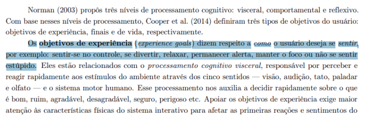
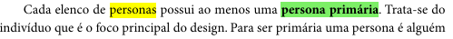
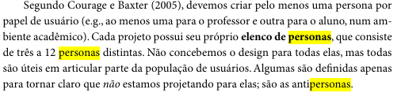
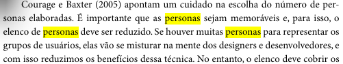

# Verificação Elenco de Personas

## Introdução

Este documento tem como objetivo apresentar a lista de verificação do artefato relacionado ao Elenco de Personas.

## Lista de Vertificação

A tabela abaixo apresenta a lista de verificação do artefato de Elenco de Personas do projeto. As respostas da lista podem ser: "Conforme", "Não Conforme", "Não Aplicável" e "Sugestão de Melhoria".

**Tabela 1** - Lista de Verificação - Elenco de Personas.

| Item | Pergunta | Resposta | Versão, data e horário da avaliação | Referência |
|------|----------|----------|--------------------------------------|-------------|
| 1    | O elenco de personas de um projeto deve incluir entre três a 12 personas distintas? | Não aplicável         | 1.0, 02/02/2025 às 23:20 |  SILVA, B. S.; BARBOSA, S. D. J. Interação Humano-Computador. 1. ed. Rio de Janeiro: Editora Campus, 2010. p. 179. Capítulo 6: Organização do Espaço de Problema. |
| 2    | O número de personas no elenco deve ser limitado para garantir que elas sejam memoráveis e eficazes no processo de design? | Não aplicável         | 1.0, 02/02/2025 às 23:20 |  SILVA, B. S.; BARBOSA, S. D. J. Interação Humano-Computador. 1. ed. Rio de Janeiro: Editora Campus, 2010. p. 180. Capítulo 6: Organização do Espaço de Problema. |
| 3    | O elenco de personas deve cobrir os principais grupos de usuários, incluindo ao menos uma persona primária, para garantir que o design atenda às necessidades do público-alvo? |  Não aplicável        | 1.0, 02/02/2025 às 23:20 |   SILVA, B. S.; BARBOSA, S. D. J. Interação Humano-Computador. 1. ed. Rio de Janeiro: Editora Campus, 2010. p. 180. Capítulo 6: Organização do Espaço de Problema. |
| 4    | O projeto possui antipersonas? | Não aplicável         | 1.0, 02/02/2025 às 23:20 |   BARBOSA, S. D. J.; SANTANA, B. Interação Humano-Computador. 1. ed. Rio de Janeiro: Elsevier, 2010. Capítulo 6, p. 179. |
| 5    | O projeto possui ao menos uma persona primária que seria o foco principal do design? | Não aplicável         | 1.0, 02/02/2025 às 23:20 |    BARBOSA, S. D. J.; SANTANA, B. Interação Humano-Computador. 1. ed. Rio de Janeiro: Elsevier, 2010. Capítulo 6, p. 179 e 180. |
| 6    | Foi realizada uma revisão para garantir que o número de personas fosse adequado, de modo que não houvesse confusão sobre as suas características? | Não aplicável     | 1.0, 03/02/2025 às 20:47 |  Página 155, Capítulo 8. Organização do Espaço de Problema. Barbosa, S. D. J.; Silva, B. S. da; Silveira, M. S.; Gasparini, I.; Darin, T.; Barbosa, G. D. J. (2021) Interação Humano-Computador e Experiência do usuário. Autopublicação. |
| 7    | Ao criar o elenco de personas, a equipe seguiu a recomendação de limitar a três personas primárias, garantindo uma cobertura eficaz dos principais grupos de usuários? | Não aplicável     | 1.0, 03/02/2025 às 20:47 |  Página 155 Capítulo 8. Organização do Espaço de Problema. Barbosa, S. D. J.; Silva, B. S. da; Silveira, M. S.; Gasparini, I.; Darin, T.; Barbosa, G. D. J. (2021) Interação Humano-Computador e Experiência do usuário. Autopublicação. |
| 8   | O elenco de personas apresenta ao menos uma persona primária? | Não aplicável | 1.0, 03/02/2025 às 20:47 |  BARBOSA, Simone Diniz Junqueira; SILVA, Bruno Santana da. Interação Humano-Computador. Rio de Janeiro: Elsevier, 2010. p. 179. |
| 9   | As personas correspondem a uma função que o usuário deve exercer? | Não aplicável | 1.0, 03/02/2025 às 20:47 |  BARBOSA, Simone Diniz Junqueira; SILVA, Bruno Santana da. Interação Humano-Computador. Rio de Janeiro: Elsevier, 2010. p. 179. |
| 10  | A quantidade de personas do elenco é adequada para representar os grupos de usuário? | Não aplicável | 1.0, 03/02/2025 às 20:47 |  BARBOSA, Simone Diniz Junqueira; SILVA, Bruno Santana da. Interação Humano-Computador. Rio de Janeiro: Elsevier, 2010. p. 180. |
| 11  | O elenco de personas contém pelo menos uma persona para cada papel de usuário no sistema? | Não aplicável | 1.0, 03/02/2025 às 20:47 |  BARBOSA, Simone Diniz Junqueira; SILVA, Bruno Santana da. Interação Humano-Computador. Rio de Janeiro: Elsevier, 2010. p. 180. |
| 12  | O elenco de personas inclui ao menos uma persona primária, que representa o foco principal do design? | Não aplicável | 1.0, 03/02/2025 às 20:47 |  BARBOSA, Simone Diniz Junqueira; SILVA, Bruno Santana da. Interação Humano-Computador. Rio de Janeiro: Elsevier, 2010. p. 180. |
| 13  | O número de personas no elenco é reduzido o suficiente para torná-las memoráveis, mas ainda cobre os principais grupos de usuários? | Não aplicável | 1.0, 03/02/2025 às 20:47 |  BARBOSA, Simone Diniz Junqueira; SILVA, Bruno Santana da. Interação Humano-Computador. Rio de Janeiro: Elsevier, 2010. p. 180. |

Autor(es): [Felipe Rodrigues](https://github.com/felipeJRdev), [Jéssica Eveline](https://github.com/xzxjese), [Ruan Carvalho](https://github.com/Ruan-Carvalho), [João Vitor Santos](https://github.com/Jauzimm) e [Marcelo Adrian](https://github.com/Marcelo-Adrian) 2025.

## Referência Bibliográfica

> BARBOSA, Simone Diniz Junqueira; SILVA, Bruno Santana da. *Interação Humano-Computador*. Rio de Janeiro: Elsevier, 2010.  
> Barbosa, S. D. J.; Silva, B. S. da; Silveira, M. S.; Gasparini, I.; Darin, T.; Barbosa, G. D. J. (2021) Interação Humano-Computador e Experiência do usuário.

## Histórico de Versões

**Tabela 2** - Histórico de versões.

| Versão | Descrição | Autor(es) | Data | Revisor(es) | Data de revisão |
| :----: | :-------: | :-------: | :--: | :-------------------------------: | :-------------: |
|  1.0   | Criação do Documento | [Felipe Rodrigues](https://github.com/felipeJRdev) | 02/02/2025 | [Ruan Carvalho](https://github.com/Ruan-Carvalho), [João Vitor Santos](https://github.com/Jauzimm) e [Marcelo Adrian](https://github.com/Marcelo-Adrian) | 03/02/2025 |