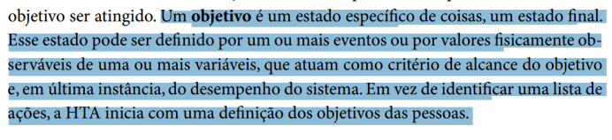
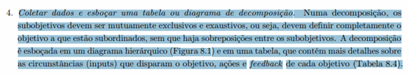

# Verificação Análise hierárquica de tarefas  (HTA – Hierarchical Task Analysis)

## Introdução

Este documento tem como objetivo apresentar a lista de verificação do artefato relacionado a Análise hierárquica de tarefas (HTA – Hierarchical Task Analysis).

## Lista de Vertificação

A tabela abaixo apresenta a lista de verificação do artefato de Análise hierárquica de tarefas (HTA – Hierarchical Task Analysis) do projeto. As respostas da lista podem ser: "Conforme", "Não Conforme", "Não Aplicável" e "Sugestão de Melhoria".

**Tabela 1** - Lista de Verificação - Análise hierárquica de tarefas (HTA – Hierarchical Task Analysis).

| Item | Pergunta | Resposta | Versão, data e horário da avaliação | Referência |
|------|----------|----------|--------------------------------------|-------------|
| 1    | Os objetivos de alto nível e os subobjetivos foram definidos de forma clara e hierárquica? | Conforme | 1.0, 03/02/2025, 21:13 |  SILVA, B. S.; BARBOSA, S. D. J. Interação Humano-Computador. 1. ed. Rio de Janeiro: Editora Campus, 2010. p. 193. Capítulo 6: Organização do Espaço de Problema. |
| 2    | Os planos foram documentados, definindo as relações entre os subobjetivos (sequência fixa, regra de seleção ou paralelismo)? | Não conforme | 1.0, 03/02/2025, 21:13 |  SILVA, B. S.; BARBOSA, S. D. J. Interação Humano-Computador. 1. ed. Rio de Janeiro: Editora Campus, 2010. p. 193. Capítulo 6: Organização do Espaço de Problema. |
| 3    | A análise hierárquica de tarefas (HTA) possui um objetivo definido no início? | Conforme | 1.0, 03/02/2025, 21:14 |  BARBOSA, S. D. J.; SANTANA, B. Interação Humano-Computador. 1. ed. Rio de Janeiro: Elsevier, 2010. Capítulo 6, Item 6.4.1, p. 192. |
| 4    | A HTA possui sub-objetivos bem relacionados e representados? Relação de sequência fixa; regra de seleção ou decisão; paralelo ou operação. | Conforme | 1.0, 03/02/2025, 21:14 |  BARBOSA, S. D. J.; SANTANA, B. Interação Humano-Computador. 1. ed. Rio de Janeiro: Elsevier, 2010. Capítulo 6, Item 6.4.1, p. 193. |
| 5    | Foi decomposta as tarefas em subobjetivos de forma clara e hierárquica, facilitando a compreensão do processo de realização da tarefa? | Conforme | 1.0, 03/02/2025, 21:15 |  Página 164, Capítulo 8. Organização do Espaço de Problema. Barbosa, S. D. J.; Silva, B. S. da; Silveira, M. S.; Gasparini, I.; Darin, T.; Barbosa, G. D. J. (2021) Interação Humano-Computador e Experiência do usuário. Autopublicação. |
| 6    | Durante a construção do HTA, foram analisadas as relações entre os subobjetivos, identificando se essas relações eram sequenciais, de seleção ou paralelas? | Conforme | 1.0, 03/02/2025, 21:17 |  Página 165, Capítulo 8. Organização do Espaço de Problema. Barbosa, S. D. J.; Silva, B. S. da; Silveira, M. S.; Gasparini, I.; Darin, T.; Barbosa, G. D. J. (2021) Interação Humano-Computador e Experiência do usuário. Autopublicação. |
| 7    | Durante a decomposição, foi certificado que os subobjetivos eram mutuamente exclusivos e exaustivos, ou seja, cobriam completamente o objetivo principal sem sobreposição? | Conforme | 1.0, 03/02/2025, 21:17 |  Página 167, Capítulo 8. Organização do Espaço de Problema. Barbosa, S. D. J.; Silva, B. S. da; Silveira, M. S.; Gasparini, I.; Darin, T.; Barbosa, G. D. J. (2021) Interação Humano-Computador e Experiência do usuário. Autopublicação. |
| 8    | A tarefa principal foi claramente identificada? | Conforme | 1.0, 03/02/2025, 21:17 |  BARBOSA, Simone Diniz Junqueira; SILVA, Bruno Santana da. Interação Humano-Computador. Rio de Janeiro: Elsevier, 2010. p. 193. |
| 9    | O desdobramento hierárquico está bem definido e organizado? | Conforme | 1.0, 03/02/2025, 21:18 |  BARBOSA, Simone Diniz Junqueira; SILVA, Bruno Santana da. Interação Humano-Computador. Rio de Janeiro: Elsevier, 2010. p. 193. |
| 10   | Foram identificados sub-objetivos críticos que podem gerar dificuldades ou erros? | Não conforme | 1.0, 03/02/2025, 21:19 |  BARBOSA, Simone Diniz Junqueira; SILVA, Bruno Santana da. Interação Humano-Computador. Rio de Janeiro: Elsevier, 2010. p. 192 . |
| 11   | No nível mais baixo da hierarquia, os subobjetivos são detalhados em operações fundamentais? | Não conforme | 1.0, 03/02/2025, 21:21 |  BARBOSA, Simone Diniz Junqueira; SILVA, Bruno Santana da. Interação Humano-Computador. Rio de Janeiro: Elsevier, 2010. p. 192. |

Autor(es): [Felipe Rodrigues](https://github.com/felipeJRdev), [Jéssica Eveline](https://github.com/xzxjese), [Ruan Carvalho](https://github.com/Ruan-Carvalho), [João Vitor Santos](https://github.com/Jauzimm) e [Marcelo Adrian](https://github.com/Marcelo-Adrian), 2025.

## Referência Bibliográfica

> BARBOSA, Simone Diniz Junqueira; SILVA, Bruno Santana da. *Interação Humano-Computador*. Rio de Janeiro: Elsevier, 2010.  
> Barbosa, S. D. J.; Silva, B. S. da; Silveira, M. S.; Gasparini, I.; Darin, T.; Barbosa, G. D. J. (2021) Interação Humano-Computador e Experiência do usuário.

## Histórico de Versões

**Tabela 2** - Histórico de versões.

| Versão | Descrição | Autor(es) | Data | Revisor(es) | Data de revisão |
| :----: | :-------: | :-------: | :--: | :-------------------------------: | :-------------: |
|  1.0   | Criação do Documento | [Felipe Rodrigues](https://github.com/felipeJRdev) | 02/02/2025 | [Ruan Carvalho](https://github.com/Ruan-Carvalho), [João Vitor Santos](https://github.com/Jauzimm) e [Marcelo Adrian](https://github.com/Marcelo-Adrian) | 03/02/2025 |