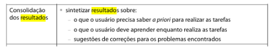
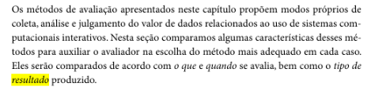

# Verificação  O Planejamento do Resultado e o Resultado da Avaliação

## Introdução

Este documento tem como objetivo apresentar a lista de verificação do artefato relacionado a  O Planejamento do Resultado e o Resultado da Avaliação.

## Lista de Vertificação

A tabela abaixo apresenta a lista de verificação do artefato de  O Planejamento do Resultado e o Resultado da Avaliação do projeto. As respostas da lista podem ser: "Conforme", "Não Conforme", "Não Aplicável" e "Sugestão de Melhoria".

*Tabela 1* - Lista de Verificação -  O Planejamento do Resultado e o Resultado da Avaliação.

| Item | Pergunta | Resposta | Versão, data e horário da avaliação | Referência |
|------|----------|----------|--------------------------------------|-------------|
| 1    | A avaliação se inicia com a descrição de como o protótipo foi apresentado aos participantes, incluindo a explicação sobre os elementos de interface e a forma de interação com eles? |      Conforme    | 1.0, 02/02/2025 às 23:20 |  SILVA, B. S.; BARBOSA, S. D. J. Interação Humano-Computador. 1. ed. Rio de Janeiro: Editora Campus, 2010. p. 360. Capítulo 10: Métodos de Avaliação de IHC. |
| 2    | Na consolidação de resultados, os avaliadores endereçam novamente as questões que motivaram o estudo, buscando respondê-las ou justificar por que alguma resposta não foi encontrada? |     Conforme      | 1.0, 02/02/2025 às 23:20 |  BARBOSA, S. D. J.; SANTANA, B. Interação Humano-Computador. 1. ed. Rio de Janeiro: Elsevier, 2010. Capítulo 9, Item 9.7.5, p. 311. |
| 3    | O relato dos resultados possui os seguintes itens: - Os objetivos e escopo da avaliação; - A forma como a avaliação foi realizada (método de avaliação empregado); - O número e o perfil de usuários e avaliadores que participaram da avaliação; - Um sumário dos dados coletados, incluindo tabelas e gráficos; - Uma interpretação e análise dos dados; - Uma lista dos problemas encontrados e - Um planejamento para o reprojeto do sistema? |    Conforme       | 1.0, 02/02/2025 às 23:20 |  BARBOSA, S. D. J.; SANTANA, B. Interação Humano-Computador. 1. ed. Rio de Janeiro: Elsevier, 2010. Capítulo 9, Item 9.7.5, p. 311. |
| 4    | Foi tomada as precauções éticas necessárias para garantir que os participantes da avaliação sejam respeitados e não sejam prejudicados direta ou indiretamente? | Conforme  | 1.0, 03/02/2025 |  Página 264, Capítulo 11. Planejamento da Avaliação de IHC. Barbosa, S. D. J.; Silva, B. S. da; Silveira, M. S.; Gasparini, I.; Darin, T.; Barbosa, G. D. J. (2021) Interação Humano-Computador e Experiência do usuário. Autopublicação. |
| 5    | Foi tomada medidas para evitar que a relação próxima com os participantes, como amigos ou colegas, influenciasse ou contaminasse os dados coletados na avaliação? | Conforme  | 1.0, 03/02/2025 |  Página 260, Capítulo 11. Planejamento da Avaliação de IHC. Barbosa, S. D. J.; Silva, B. S. da; Silveira, M. S.; Gasparini, I.; Darin, T.; Barbosa, G. D. J. (2021) Interação Humano-Computador e Experiência do usuário. Autopublicação. |
| 6    | Foi feita uma conversação pós-teste para coletar mais dados, como a opinião do participante? | Conforme  | 1.0, 03/02/2025 |  Página 262, Capítulo 11. Planejamento da Avaliação de IHC. Barbosa, S. D. J.; Silva, B. S. da; Silveira, M. S.; Gasparini, I.; Darin, T.; Barbosa, G. D. J. (2021) Interação Humano-Computador e Experiência do usuário. Autopublicação. |
| 7    | O planejamento dos resultados contém os itens necessários para a avaliação (objetivos, escopo, descrição do método de teste, etc)? | Conforme  | 1.0, 03/02/2025 |  BARBOSA, Simone Diniz Junqueira; SILVA, Bruno Santana da. Interação Humano-Computador. Rio de Janeiro: Elsevier, 2010. p. 343. |
| 8    | O planejamento dos resultados está de acordo com os dados que vão ser obtidos a partir do método de avaliação selecionado? | Conforme  | 1.0, 03/02/2025 |  BARBOSA, Simone Diniz Junqueira; SILVA, Bruno Santana da. Interação Humano-Computador. Rio de Janeiro: Elsevier, 2010. p. 323. |
| 9    | O relato inclui o conhecimento que os usuários devem possuir previamente para executar as tarefas? | Não Conforme  | 1.0, 03/02/2025 |  BARBOSA, Simone Diniz Junqueira; SILVA, Bruno Santana da. Interação Humano-Computador. Rio de Janeiro: Elsevier, 2010. p. 362. |

Autor(es): [Felipe Rodrigues](https://github.com/felipeJRdev), [Jéssica Eveline](https://github.com/xzxjese), [Ruan Carvalho](https://github.com/Ruan-Carvalho), [João Vitor Santos](https://github.com/Jauzimm) e [Marcelo Adrian](https://github.com/Marcelo-Adrian) 2025.

## Referência Bibliográfica

> BARBOSA, Simone Diniz Junqueira; SILVA, Bruno Santana da. Interação Humano-Computador. Rio de Janeiro: Elsevier, 2010.  
> Barbosa, S. D. J.; Silva, B. S. da; Silveira, M. S.; Gasparini, I.; Darin, T.; Barbosa, G. D. J. (2021) Interação Humano-Computador e Experiência do usuário.

## Histórico de Versões

*Tabela 2* - Histórico de versões.

| Versão | Descrição | Autor(es) | Data | Revisor(es) | Data de revisão |
| :----: | :-------: | :-------: | :--: | :-------------------------------: | :-------------: |
|  1.0   | Criação do Documento | [Felipe Rodrigues](https://github.com/felipeJRdev) | 02/02/2025 | [Ruan Carvalho](https://github.com/Ruan-Carvalho), [João Vitor Santos](https://github.com/Jauzimm) e [Marcelo Adrian](https://github.com/Marcelo-Adrian) | 03/02/2025 |