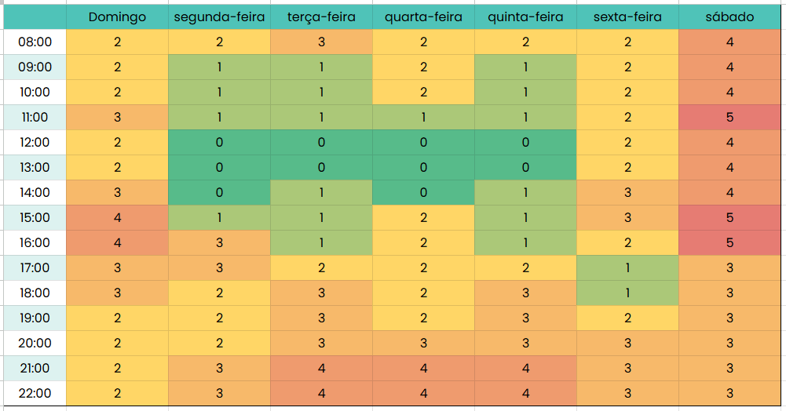

# HeatMap

## Introdução
No projeto, optou-se pela utilização de um heatmap como uma ferramenta visual eficaz para ilustrar a disponibilidade coletiva dos participantes durante a semana. Essa abordagem permite uma análise detalhada e intuitiva da disponibilidade de cada membro, facilitando o planejamento de eventos em grupo ao consolidar as informações de todos os envolvidos em uma única representação gráfica.

## Objetivos
Este heatmap foi desenvolvido com o objetivo de mapear a disponibilidade de horário entre os membros do grupo, visando encontrar um horário livre comum para reuniões e desenvolvimento do projeto.

## Metodologia
O processo de realização do heatmap teve seu início com a coleta de dados de disponibilidade dos membros do grupo, organizados em uma planilha. Com base no agrupamento desses dados, identificou-se o melhor horário para a realização das reuniões do grupo.

**Segue abaixo o heatmap do grupo 05:**

**Figura 1** - Heatmap de disponibilidade dos integrantes.

Autor(es):  [João Vitor](https://github.com/Jauzimm), [Ruan Carvalho](https://github.com/Ruan-Carvalho), 2024.

## Bibliografia

SILVA, André Barros. Exemplo de Heatmap. Interação Humano Computador, 2° semestre de 2024. Disponível em: https://docs.google.com/spreadsheets/d/1qsrnEGGf6XWL3buII_7EzXH1-NXewr9G0aicRZ9fVAs/edit?gid=96807035#gid=96807035. Acesso em: 10 nov. 2024.

## Disponibilidade
De acordo com o heatmap, a equipe tem a possibilidade de realizar reuniões aos sábados nos seguintes horários:
- 11:00 - 12:00
- 15:00 - 16:00
- 16:00 - 17:00

## **Histórico de Versões**

**Tabela 1** - Histórico de versões.

| Versão |          Descrição              |     Autor      |      Data      |   Revisor     |    Data de revisão    |  
|:------:|:-------------------------------:|:--------------:|:--------------:|:-------------:|:---------------------:|
|  1.0   | Versão Inicial|   [João Vitor](https://github.com/Jauzimm)  |   05/11/2024   | [Marcelo Adrian](https://github.com/Marcelo-Adrian)  |   10/11/2024 |
| 1.1 | Complemento do heatmap | [Ruan Carvalho](https://github.com/Ruan-Carvalho) | 12/11/2024 | [Marcelo Adrian](https://github.com/Marcelo-Adrian) |12/11/2024|
|1.2|Padronização de Referências Bibliográficas, Bibliografia e Autor(es)|[Felipe Rodrigues](https://github.com/felipeJRdev)|23/11/2024| [Marcelo Adrian](https://github.com/Marcelo-Adrian)  | 24/11/2024  |